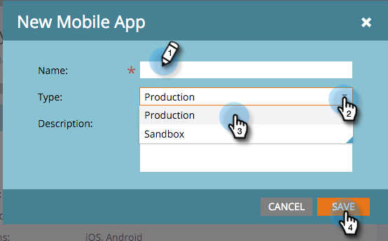

# Ajout d’une application mobile {#add-a-mobile-app}

Envoyez des notifications push à votre base de clients en connectant votre application mobile à Marketo.

Les applications démarrent normalement dans un environnement de test, où le développement et les tests initiaux sont effectués. Les développeurs utilisent ensuite un environnement de production pour créer l’application finale qui sera utilisée par les clients. Vous devez sélectionner le certificat de notification approprié lors de l’ajout d’une application mobile (voir l’étape 4 ci-dessous).

>[!AVAILABILITY]
>
>
>Tous les utilisateurs de Marketo Engage n’ont pas acheté cette fonctionnalité. Pour plus d’informations, contactez l’équipe du compte d’Adobe (votre gestionnaire de compte).

1. Cliquez sur **Admin**.

   

1. Cliquez sur **Applications et périphériques mobiles**.

   

1. Cliquez sur **Nouvelle application mobile**.

   

1. Saisissez un nom. Dans la liste déroulante **Type**, sélectionnez le type d’environnement que vous utilisez : environnement de test ou production. Cliquez sur **Enregistrer**.

   

   >[!NOTE]
   >
   >Nous vous recommandons d’utiliser un certificat de notification de production dans un environnement de production. Un certificat Sandbox s’installe sans problème dans un environnement de production, mais vous ne recevrez pas de notifications. Pour toute question concernant votre environnement ou votre certificat de notification, contactez votre administrateur Marketo ou votre développeur d’applications mobiles.

   Beau ! Maintenant, configurez votre application pour qu’elle fonctionne avec les appareils Android et iOS.

>[!MORELIKETHIS]
>
>* [Configurer Mobile App Android Push Access](/help/marketo/product-docs/mobile-marketing/admin/configure-mobile-app-android-push-access.md)
>* [Configurer Mobile App iOS Push Access](/help/marketo/product-docs/mobile-marketing/admin/configure-mobile-app-ios-push-access.md)
