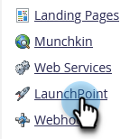
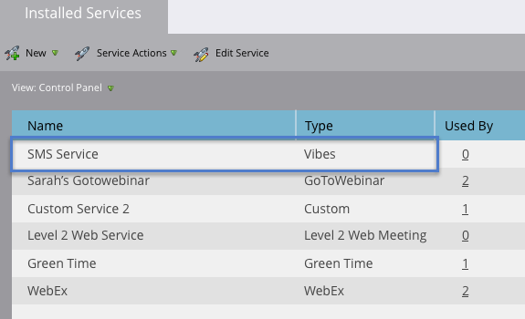

# Ajout de Vibes as a LaunchPoint Service {#add-vibes-as-a-launchpoint-service}

Vous pouvez envoyer des SMS aux personnes inscrites à vos campagnes SMS Vibes, en utilisant l’activité SMS pour déclencher et filtrer des campagnes de manière navale dans votre instance Marketo Engage. Tout d’abord, vous devez ajouter Vibes as a LaunchPoint Service.

>[!NOTE]
>
>**Autorisations d’administrateur requises**

>[!PREREQUISITES]
>
>Vous devez disposer d&#39;un compte Vibes actif et d&#39;une licence Adobe pour les SMS Vibes.

1. Dans Mon Marketo, accédez à la zone **[!UICONTROL Admin]**.

   

1. Cliquez sur **[!UICONTROL LaunchPoint]**.

   

1. Cliquez sur **[!UICONTROL Nouveau]**, puis sur **[!UICONTROL Nouveau service]**.

   

1. Saisissez un nom d’affichage et, dans la liste déroulante, sélectionnez **[!UICONTROL Vibes]**.

   

1. Sous Paramètres, saisissez vos Vibes [!UICONTROL Nom d&#39;utilisateur], [!UICONTROL Mot de passe] et [!UICONTROL Clé de la société] (toutes ces informations se trouvent dans votre compte Vibes). Cliquez sur **[!UICONTROL Créer]**.

   

   Le nouveau service SMS apparaît désormais dans la liste [!UICONTROL Services installés].

   

>[!MORELIKETHIS]
>
>[Démo vidéo Vibes](https://vimeo.com/215233767/1ed136adbc)
