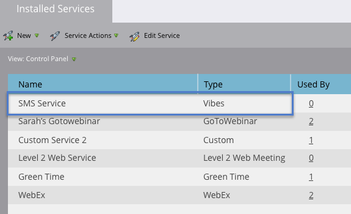

# Ajout de vidéos en tant que service LaunchPoint {#add-vibes-as-a-launchpoint-service}

Vous pouvez envoyer des SMS aux personnes ayant accepté de participer à vos campagnes SMS Vibes, en exploitant l’activité SMS pour déclencher et filtrer des campagnes de manière autonome dans votre instance de Marketo Engage. Tout d’abord, vous devez ajouter Vibes as a LaunchPoint service.

>[!NOTE]
>
>**Autorisations d’administrateur requises**

>[!AVAILABILITY]
>
>Vous devez disposer d’un compte Vibes actif et d’une licence d’Adobe pour Vibes SMS. Marketo Vibes L’intégration native SMS est disponible aux États-Unis et au Canada. Pour les autres pays, une connexion via les webhooks Marketo peut être utilisée par [contact direct de vidéos](https://www.vibes.com/talk-to-sales){target="_blank"}.

1. Dans Mon Marketo, accédez au **[!UICONTROL Administration]** zone.

   

1. Cliquez sur **[!UICONTROL LaunchPoint]**.

   

1. Cliquez sur **[!UICONTROL Nouveau]**, puis **[!UICONTROL Nouveau service]**.

   

1. Saisissez un nom d’affichage puis, dans la liste déroulante, sélectionnez **[!UICONTROL Vibes]**.

   

1. Sous Paramètres, saisissez vos vidéos. [!UICONTROL Nom d’utilisateur], [!UICONTROL Password], et [!UICONTROL Clé de société] (tous ces éléments sont disponibles dans votre compte Vibes). Cliquez sur **[!UICONTROL Créer]**.

   

   Le nouveau service SMS apparaît désormais dans la variable [!UICONTROL Services installés] liste.

   

>[!MORELIKETHIS]
>
>[Vibes video demo](https://vimeo.com/215233767/1ed136adbc){target="_blank"}
