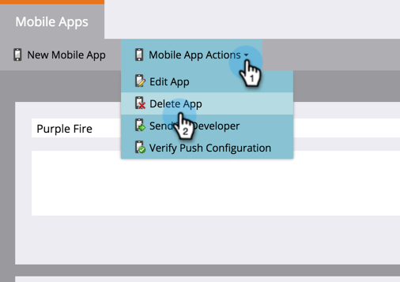

# Supprimer l&#39;application mobile {#delete-mobile-app}

1. Cliquez sur Admin.

   

1. Sélectionnez Applications mobiles.

   

1. Sélectionnez l’application mobile de votre choix.

   

1. Cliquez sur Actions de l’application mobile et sélectionnez Supprimer l’application.

   

1. Confirmez en cliquant sur DELETE.

   

Ta-da ! La notification Push ne peut plus être envoyée à partir de cette application mobile.
