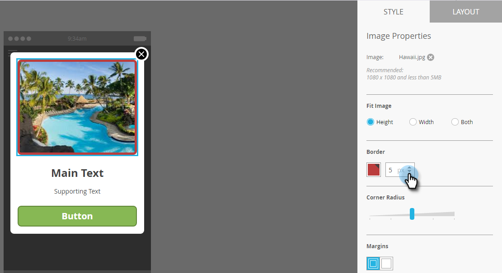
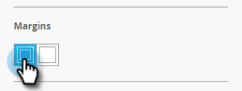

# Ajouter des images de message in-app {#add-in-app-message-images}

C’est ici que vous choisissez et personnalisez vos images de messages in-app.

1. Sélectionnez le message in-app et cliquez sur **Modifier le brouillon**.

   

1. Sélectionnez l’un des six modèles dans le panneau Disposition. Il y a trois fenêtres contextuelles et trois options plein écran.

   >[!TIP]
   >
   >Quelle est la différence entre les modèles ? Voir [Choisir une mise en page pour votre message intégré](/help/marketo/product-docs/mobile-marketing/in-app-messages/creating-in-app-messages/choose-a-layout-for-your-in-app-message.md) avant de commencer.

   

1. Cliquez sur l&#39;onglet **Style** et cliquez sur la zone d&#39;image du modèle.

   

1. Cliquez sur **Sélectionner une image**.

   

1. Sélectionnez votre image dans Design Studio et cliquez sur **Sélectionner**.

   

   >[!NOTE]
   >
   >La taille de l’image est limitée à 1 440 x 2 560 px et 5 Mo.

1. Changez d&#39;avis et souhaitez utiliser une image différente ? Pas de problème. Cliquez sur **X** en regard du nom de fichier de l’image.

   

1. Cliquez sur **Supprimer**. Maintenant, vous pouvez en choisir un autre.

   

1. Lorsque l’image de votre choix est en place, dans Propriétés de l’image, sélectionnez un bouton pour l’adapter à la hauteur, à la largeur ou aux deux.

   

1. Vous pouvez éventuellement appliquer une bordure d’image. Le paramètre par défaut est **Désactivé**. Tout d&#39;abord, sélectionnez la couleur en cliquant dessus ou en entrant les valeurs hexadécimales ou RVB dans le sélecteur de couleurs.

   

1. Cliquez sur les flèches pour modifier la largeur de la bordure, en pixels. Vous verrez qu&#39;il change sur l&#39;image.

   

1. Sélectionnez un rayon d’angle à l’aide du curseur. Sélectionnez une position de gauche à droite : 0, 4, 8, 12 ou 16 pixels. La sélection de 8 pixels (au centre) est la valeur par défaut.

   

1. Sélectionnez une marge (activée ou désactivée). **** Onis est le paramètre par défaut.

   

1. Cochez la case permettant de définir une action de rognage d’image.

   

1. Il existe une action distincte pour chaque plateforme (voir la remarque).

   

1. Cliquez sur chaque liste déroulante pour afficher les options. Sélectionnez-en un.

   

   >[!NOTE]
   >
   >Pour les actions d’appui sur les images, les boutons ou les arrière-plans, vous pouvez configurer différentes actions pour les plateformes Apple et Android. Par exemple, les liens profonds sont gérés différemment pour Apple et Android. Si votre message ne s’adresse qu’à une seule plateforme ou à l’autre, laissez l’autre plateforme dans le paramètre par défaut ou sélectionnez **Aucun**.

Super travail ! Il est maintenant temps de [créer le texte de votre message in-app](/help/marketo/product-docs/mobile-marketing/in-app-messages/creating-in-app-messages/create-in-app-message-text.md).

>[!MORELIKETHIS]
>
>* [Présentation des messages in-app](/help/marketo/product-docs/mobile-marketing/in-app-messages/understanding-in-app-messages.md)
>* [Choisir une mise en page pour votre message intégré](/help/marketo/product-docs/mobile-marketing/in-app-messages/creating-in-app-messages/choose-a-layout-for-your-in-app-message.md)

