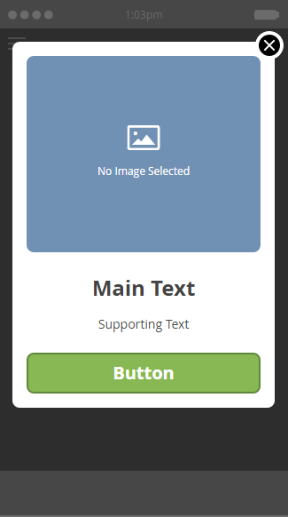

# Choisir une mise en page pour votre message intégré {#choose-a-layout-for-your-in-app-message}

Marketo fournit six mises en page pour la création de messages in-app.

* Les mises en page pop-up sont plus traditionnelles et idéales si vous n’avez pas d’équipe créative pour fournir du contenu et que vous n’avez pas besoin d’une apparence spécifique. Vous pouvez facilement créer et modifier votre propre message in-app, dans Marketing Cloud.
* Les dispositions plein écran vous permettent d’importer vos propres conceptions terminées, ce qui vous offre une flexibilité graphique complète.

## Mise en page contextuelle {#pop-up-layouts}

Les trois fenêtres contextuelles présentent tous les éléments de conception prédéfinis des offres, y compris une image, un texte, des boutons et un arrière-plan.

La première mise en page contextuelle est la sélection par défaut pour une bonne raison : Il convient à la plupart des usages. Il fonctionne correctement avec les images à résolution inférieure. Cette mise en page utilise les polices standard pour votre plate-forme (Helvetica pour Apple, Roboto pour Android), de sorte qu&#39;elle s&#39;affiche toujours sur un téléphone ou une tablette. Vous pouvez télécharger et placer les images principales et d’arrière-plan, écrire votre texte principal et votre texte de prise en charge, et configurer les boutons principal et d’exclusion. Le texte est limité à trois lignes à 24 pixels. Des tailles de type plus grandes réduisent le nombre de lignes.

La deuxième mise en page Fenêtre déroulante élimine les zones de texte, ce qui vous donne plus de place pour une image plus grande. Ajoutez du texte, dans votre choix de style, à l’image avant de l’importer, pour obtenir un aspect personnalisé.

La troisième mise en page Fenêtre contextuelle est idéale si vous n’avez pas besoin d’utiliser une image dans votre message in-app. Deux boutons signifient aux destinataires un choix d&#39;actions. Le texte est limité à trois lignes. Des tailles de type plus grandes réduiront le nombre de lignes disponibles.

## Mise en page plein écran {#full-screen-layouts}

Les trois mises en page de style plein écran sont conçues pour vous permettre d’importer des illustrations graphiques complètes. Sélectionnez vos propres polices et incorporez-les dans le graphique pour qu’elles correspondent à n’importe quelle page Web ou promotion.

La première mise en page plein écran offre un canevas vierge. Il affiche exactement ce que vous téléchargez, sans étirer ni recadrer l’image (voir l’exemple ci-dessous). Il se réduit pour s’ajuster, laissant des zones vierges autour, selon la forme de l’image. Aucune partie de l’image n’est supprimée.

Notez que cette image horizontale affiche toute sa largeur, laissant un espace vide au-dessus et en dessous.

La deuxième mise en page plein écran ajoute des champs de texte et un bouton.

Contrairement à la première mise en page Plein écran, celle-ci, ainsi que la troisième mise en page Plein écran (ci-dessous), étend l’image placée pour l’adapter à la hauteur complète et ajuste les côtés. Selon l’image d’origine, cela peut créer une image d’arrière-plan convaincante. Cet exemple utilise la même image que celle illustrée ci-dessus,

La troisième mise en page plein écran est identique à la seconde, à l’exception du deuxième bouton. Vous disposez ainsi de davantage d’options pour les destinataires de messages.

Maintenant que vous connaissez les modèles, il est temps d’en choisir un lorsque vous [créez vos images](add-in-app-message-images.md)de message in-app.

>[!MORELIKETHIS]
>
>* [Création d’un message intégré à l’application](http://docs.marketo.com/display/docs/create+an+in-app+message)
>* [Présentation des messages in-app](../../../../product-docs/mobile-marketing/in-app-messages/understanding-in-app-messages.md)

>

