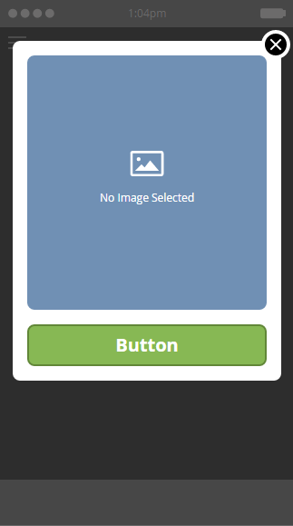

# Choisir une disposition pour votre message in-app {#choose-a-layout-for-your-in-app-message}

Marketo fournit six dispositions pour la création de messages in-app.

* Les dispositions de fenêtres contextuelles sont plus traditionnelles et sont idéales si vous n’avez pas d’équipe créative pour fournir du contenu et que vous n’avez pas besoin d’une apparence spécifique. Vous pouvez facilement créer et modifier votre propre message in-app dans Marketo
* Les dispositions Plein écran vous permettent d’importer vos propres conceptions finies, ce qui vous donne une flexibilité graphique totale

## Mises En Page Contextuelles {#pop-up-layouts}

Les trois dispositions Pop-Up proposent toutes des éléments de conception de paramètres prédéfinis, notamment une image, du texte, des boutons et un arrière-plan.

La première disposition Pop-Up est la sélection par défaut pour une bonne raison : elle convient à la plupart des utilisateurs. Cela fonctionne correctement avec les images de résolution inférieure. Cette disposition utilise les polices standard de votre plateforme (Helvetica pour Apple, Roboto pour Android), elle a donc toujours l’air d’être adaptée à un téléphone ou une tablette. Vous pouvez charger et placer les images principales et d’arrière-plan, écrire votre propre texte principal et secondaire, et configurer les boutons principal et Ignorer. Le texte est limité à trois lignes pour 24 pixels. Des tailles de caractères plus grandes réduisent le nombre de lignes.

La deuxième disposition Pop-Up élimine les zones de texte, ce qui vous donne plus d’espace pour une image plus haute. Ajoutez le texte, au style de votre choix, à l’image avant de l’importer, pour une apparence personnalisée.

La troisième disposition Pop-Up est idéale si vous n’avez pas besoin d’utiliser d’image dans votre message in-app. Deux boutons permettent aux destinataires des messages de choisir entre différentes actions. Le texte est limité à trois lignes. Des tailles de texte plus grandes réduiront le nombre de lignes disponibles.

## Mises en page plein écran {#full-screen-layouts}

Les trois dispositions de style Plein écran sont conçues pour que vous puissiez importer les illustrations graphiques terminées. Sélectionnez vos propres polices et incorporez-les dans le graphique pour qu’elles correspondent à n’importe quelle page web ou promotion.

La première disposition Plein écran offre une zone de travail vide. Elle affiche exactement ce que vous téléchargez, sans étirer ni recadrer l’image (voir l’exemple ci-dessous). Il rétrécit pour s’adapter et laisse des zones vides autour, selon la forme de l’image. Aucune partie de l’image n’est supprimée.

Notez que cette image horizontale affiche sa pleine largeur, en laissant un espace vide au-dessus et en dessous.

La deuxième disposition Plein écran ajoute des champs de texte et un bouton.

Contrairement à la première disposition Plein écran, celle-ci, ainsi que la troisième disposition Plein écran (ci-dessous), développe l’image placée pour l’adapter à toute la hauteur et rogne les côtés. Selon l’image d’origine, cela peut créer une image d’arrière-plan attrayante. Cet exemple utilise la même image que celle illustrée ci-dessus.

La troisième disposition Plein écran est identique à la deuxième, à l’exception de son deuxième bouton. Cette option offre davantage d’options aux destinataires des messages.

Maintenant que vous connaissez les modèles, il est temps d’en choisir un lorsque vous [créez vos images de message in-app](/help/marketo/product-docs/mobile-marketing/in-app-messages/creating-in-app-messages/add-in-app-message-images.md).

>[!MORELIKETHIS]
>
>[Comprendre Les Messages In-App](/help/marketo/product-docs/mobile-marketing/in-app-messages/understanding-in-app-messages.md)
