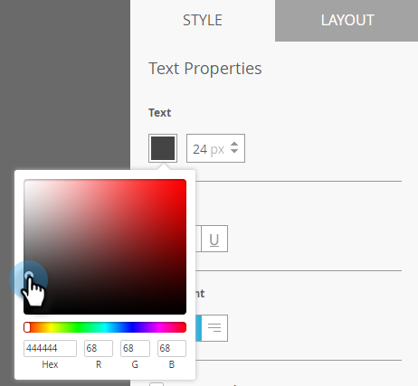
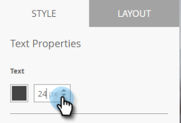
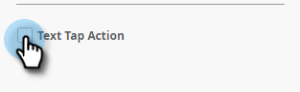

# Créer un texte de message intégré à l’application {#create-in-app-message-text}

Cliquez sur la zone de texte pour travailler sur votre style de texte et votre contenu.

1. Cliquez sur le texte principal pour le modifier en ligne.

   

1. Choisissez la couleur du texte en cliquant dessus ou en entrant les valeurs hexadécimales ou RVB dans le sélecteur de couleurs.

   

1. Cliquez sur les flèches pour sélectionner une taille de texte.

   

   >[!CAUTION]
   >
   >Une taille de texte trop importante peut pousser le contenu au-delà des trois lignes de texte visibles au maximum.

1. Choisissez un style de type facultatif pour mettre l’accent : **Gras**, *Italique* ou Souligné.

   

1. Choisissez l’alignement du texte : À gauche, Centré, À droite. Le centré est la valeur par défaut.

   

   >[!NOTE]
   >
   >La police de texte rendue dans la publicité est la police standard pour chaque plate-forme : Helvetica pour Apple et Roboto pour Android

1. Cochez la case pour sélectionner l’action d’appui sur le texte.

   

1. Sélectionnez l’action d’appui pour chaque plate-forme : Apple ou Android.

   

   >[!NOTE]
   >
   >Pour les actions d’appui, vous pouvez configurer différentes actions pour les plateformes Apple et Android. Par exemple, les liens profonds sont gérés différemment pour Apple et Android. Si votre message ne s’adresse qu’à une seule plateforme ou à l’autre, vous pouvez laisser l’autre plate-forme dans le paramètre par défaut ou sélectionner Aucun.

1. Cliquez sur le texte de prise en charge pour le modifier en ligne. Il fonctionne de la même manière que la modification du texte principal, mais la taille de texte par défaut est plus petite.

   

1. Pour le texte principal ou secondaire, cliquez sur l’icône Jeton pour ajouter un jeton.

   

1. Sélectionnez un jeton My Token dans la liste déroulante, ajoutez une valeur par défaut, puis cliquez sur **Insérer**.

   

   >[!NOTE]
   >
   >Seules les options Mes jetons sont disponibles. Si aucun jeton n&#39;a été configuré dans le programme, la liste déroulante Jeton est vide.

   >[!TIP]
   >
   >Veillez à tenir compte de la longueur des caractères à laquelle un jeton sera résolu lorsqu’il sera affiché par votre audience. Laissez suffisamment d’espace pour tenir compte des valeurs potentiellement plus longues, afin de les empêcher d’être coupées.

   Les modifications apportées aux jetons utilisés dans un programme de messages in-app approuvé ne seront pas prises en compte dans le message in-app tant que le programme n’est pas suspendu, puis repris.

Tu es dorée. Ensuite, vous devez [configurer votre bouton](set-up-the-in-app-message-button.md)de message in-app.

>[!MORELIKETHIS]
>
>* [Présentation des messages in-app](../../../../product-docs/mobile-marketing/in-app-messages/understanding-in-app-messages.md)
>* [Choisir une mise en page pour votre message intégré](choose-a-layout-for-your-in-app-message.md)

>

