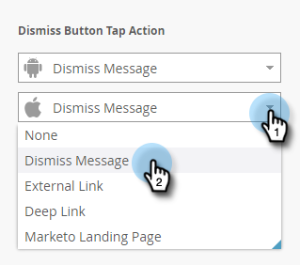

# Configuration du bouton Ignorer et approbation du message {#set-up-the-dismiss-button-and-approve-the-message}

## Configurer les propriétés du bouton Ignorer {#configure-dismiss-button-properties}

Le bouton Ignorer comporte de nombreuses options pour vous permettre de le configurer comme vous le souhaitez.

1. Dans l’éditeur, cliquez sur le bouton Ignorer.

   

1. Si vous souhaitez modifier la couleur du bouton, cliquez sur le carré de sélection de couleur. Sélectionnez une couleur en cliquant dessus ou en entrant les valeurs hexadécimales ou RVB dans le sélecteur de couleurs. Noir est la valeur par défaut.

   

1. Sélectionnez une conception de bouton dans la liste déroulante. Les boutons arrondis comportent une couleur complète et un dégradé.

   

   >[!CAUTION]
   >
   >La couleur du bouton peut s’afficher sous la forme d’un X blanc sur un arrière-plan blanc lorsque vous sélectionnez une autre conception dans la liste déroulante. Si tel est le cas, il vous suffit de sélectionner le noir ou une autre couleur dans le carré de sélection des couleurs pour rendre le X blanc visible.

1. Vous pouvez cliquer sur le bouton d’angle gauche pour déplacer le bouton d’arrêt vers la gauche (le côté droit est le bouton par défaut).

   

1. Cliquez sur la liste déroulante de chaque plate-forme et sélectionnez une action de clic pour le bouton Ignorer.

   

   >[!NOTE]
   >
   >Vous devez activer l’action d’appui sur le bouton Ignorer, de sorte qu’il n’y ait aucune case à cocher pour l’activer. L’option Message d’abandon est le choix par défaut (et évident).

## Terminer {#wrap-it-up}

Toutes vos sélections pour les graphiques, le texte et les boutons ont été enregistrées automatiquement. Maintenant, vous êtes prêt à terminer le travail.

1. Pour prévisualisation de votre message in-app, cliquez sur la liste déroulante **Actions de message** et sélectionnez **Prévisualisation**.

   

1. Prévisualisation du message in-app sur smartphone ou tablette pour vérifier qu’il s’affiche correctement.

   

1. Si le message in-app vous convient, cliquez sur **Approuver et fermer**.

   

   >[!NOTE]
   >
   >Vous pouvez également sélectionner **Approuver et fermer** directement dans la liste déroulante Actions de message (voir étape 1), mais pourquoi ne pas prévisualisation le message en premier, juste pour être sûr ?

1. Pour fermer l’éditeur sans l’approuver, il vous suffit de fermer l’onglet. Il est enregistré automatiquement, de sorte que vous puissiez le retourner et l’approuver ultérieurement.

   

Il y a tant de choix, mais maintenant vous avez un message in-app magnifique, prêt à partir !

Il est maintenant temps d&#39;[envoyer votre message](http://docs.marketo.com/display/docs/send+your+in-app+message).

>[!MORELIKETHIS]
>
>* [Présentation des messages in-app](../../../../product-docs/mobile-marketing/in-app-messages/understanding-in-app-messages.md)
>* [Envoyer votre message in-app](http://docs.marketo.com/display/docs/send+your+in-app+message)
>* [Choisir une mise en page pour votre message intégré](choose-a-layout-for-your-in-app-message.md)

>

