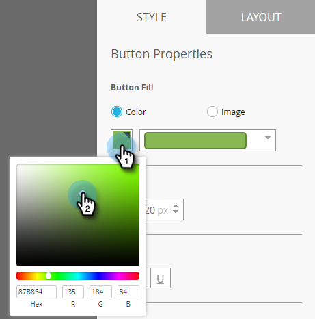
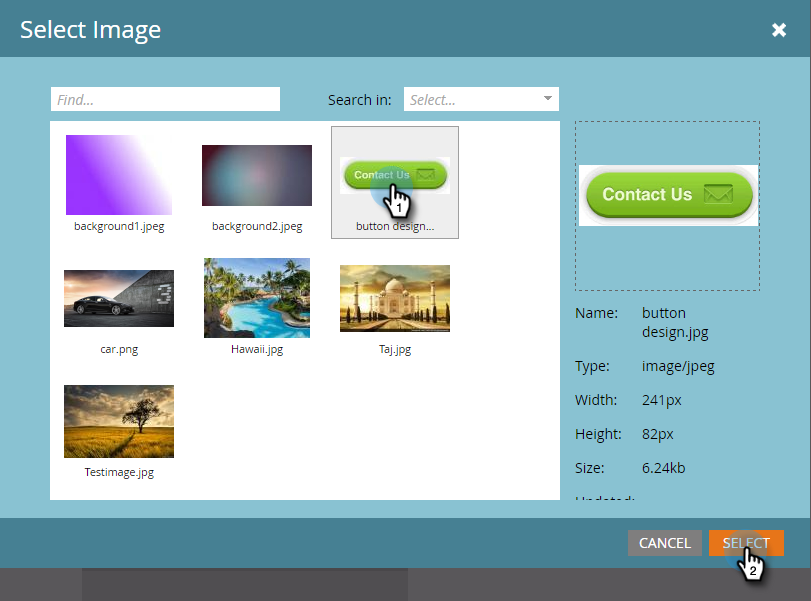

# Configuration du bouton Message intégré {#set-up-the-in-app-message-button}

Vous pouvez utiliser la conception de bouton par défaut, la modifier ou télécharger votre propre image de bouton personnalisée.

1. Cliquez sur le bouton pour ouvrir le panneau Style en vue de le modifier.

   

1. Pour modifier la couleur du bouton standard, cliquez sur le bouton **Couleur**.

   

1. Cliquez sur le carré de sélection des couleurs et sélectionnez la couleur du bouton en cliquant dessus ou en entrant les valeurs hexadécimales ou RVB dans le sélecteur de couleurs.

   

1. Sélectionnez une forme dans la liste déroulante. Les options de forme standard comprennent les coins nets, les coins arrondis et les dégradés.

   

1. Si vous souhaitez utiliser votre propre image pour un bouton, cliquez sur le bouton Image, puis sur **Sélectionner l’image**.

   

1. Sélectionnez l’image et cliquez sur **Sélectionner**.

   

   >[!TIP]
   >
   >Lorsque vous importez une image personnalisée pour le bouton, pensez à effacer le texte d’espace réservé qui y est placé si votre image contient déjà du texte.

1. Cliquez sur le carré de sélection des couleurs, puis sélectionnez la couleur de la police en cliquant dessus ou en saisissant des valeurs hexadécimales ou RVB dans le sélecteur de couleurs.

   

1. Cliquez sur les flèches pour choisir la taille de la police.

   

1. Choisissez le style de police à mettre en évidence : **Bold**, *Italic* ou Souligné.

   

1. Cliquez sur le texte du bouton pour le modifier en ligne.

   

1. Cochez la case pour définir l’action de clic sur le bouton.

   

   Cliquez sur la liste déroulante de chaque plate-forme et sélectionnez une action de clic.

   

   >[!NOTE]
   >
   >**Rappel**
   >
   >
   >Le bouton comporte toujours une action de clic, de sorte que la case à cocher Action de clic est automatiquement cochée, avec le message par défaut &quot;Message d’annulation&quot;.

   [configurer l’arrière-plan de votre message in-app et le bouton d’annulation](set-up-the-in-app-message-background.md)

Presque là. Votre dernière étape est de .

>[!MORELIKETHIS]
>
>* [Présentation des messages in-app](../../../../product-docs/mobile-marketing/in-app-messages/understanding-in-app-messages.md)
>* [Choisir une mise en page pour votre message intégré](choose-a-layout-for-your-in-app-message.md)

>

