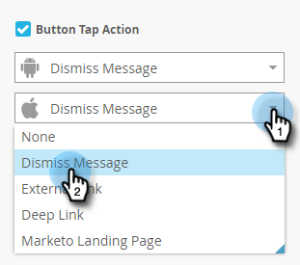

# Configuration du bouton Message in-app {#set-up-the-in-app-message-button}

Vous pouvez utiliser la conception de bouton par défaut, la modifier ou charger votre propre image de bouton personnalisée.

1. Cliquez sur le bouton pour ouvrir l’onglet Style à modifier.

   

1. Pour modifier la couleur du bouton standard, cliquez sur le bouton **Color** .

   

1. Cliquez sur le carré de sélection des couleurs et sélectionnez la couleur du bouton en cliquant dessus ou en la saisissant dans le sélecteur de couleurs à l’aide des numéros hexadécimaux ou RGB.

   

1. Sélectionnez une forme dans la liste déroulante. Les options de forme standard incluent les coins nets, les coins arrondis et les dégradés.

   

1. Si vous souhaitez utiliser votre propre image pour un bouton, cliquez sur le bouton Image, puis sur **Sélectionner l&#39;image**.

   

1. Sélectionnez l&#39;image et cliquez sur **Sélectionner**.

   

   >[!TIP]
   >
   >Lorsque vous placez une image personnalisée pour le bouton, pensez à effacer le texte de l’espace réservé qui lui est posé si votre image contient déjà du texte.

1. Cliquez sur le carré de sélection des couleurs, puis sélectionnez la couleur de la police en cliquant dessus ou en entrant des numéros hexadécimaux ou RGB dans le sélecteur de couleurs.

   

1. Cliquez sur les flèches pour choisir la taille de la police.

   

1. Choisissez le style de police pour mettre l’accent : **Bold**, _Italic_ ou Souligné.

   

1. Cliquez sur le texte du bouton pour le modifier en ligne.

   

1. Cochez la case pour définir l’action d’appui du bouton.

   

1. Cliquez sur la liste déroulante de chaque plateforme et sélectionnez une action d’appui.

   

   >[!NOTE]
   >
   >Le bouton comporte toujours une action d’appui. Par conséquent, la case à cocher Appuyer sur l’action est automatiquement sélectionnée, avec le message par défaut &quot;Ignorer le message&quot;.

Presque là. Votre dernière étape est de [configurer l’arrière-plan de votre message in-app et d’ignorer le bouton ](/help/marketo/product-docs/mobile-marketing/in-app-messages/creating-in-app-messages/set-up-the-in-app-message-background.md).

>[!MORELIKETHIS]
>
>* [Compréhension des messages In-App](/help/marketo/product-docs/mobile-marketing/in-app-messages/understanding-in-app-messages.md)
>* [Choisir une mise en page pour votre message in-app](/help/marketo/product-docs/mobile-marketing/in-app-messages/creating-in-app-messages/choose-a-layout-for-your-in-app-message.md)
