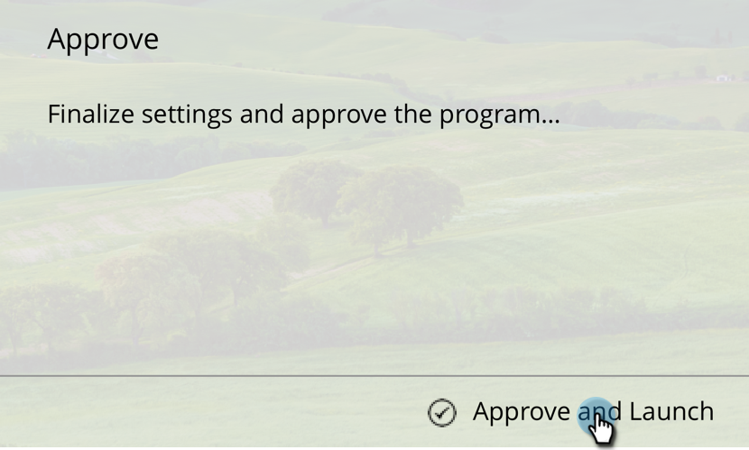
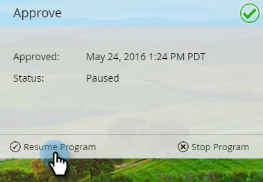
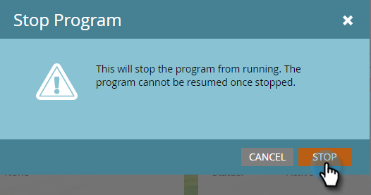

# Approuver votre message in-app {#approve-your-in-app-message}

Vous devez approuver l’envoi avant que le message in-app ne s’affiche.

1. Si tout semble correct, cliquez sur **Approuver et lancer**.

   

   >[!NOTE]
   >
   >Si une partie du processus d’envoi est incomplète, par exemple, le message in-app n’est pas approuvé, un message d’avertissement s’affiche, indiquant la zone qui doit retenir votre attention. Allez corriger cela et vous devriez voir le message à l&#39;étape 2.

1. Cliquez sur **Approuver et lancer**.

   

1. Si vous avez utilisé des champs personnalisés, l’exécution de Marketo peut prendre plus de temps et ce message s’affichera à la place.

   

1. Le message est maintenant principal.

   

   >[!NOTE]
   >
   >Il faut normalement de 15 à 30 minutes pour qu’un message in-app approuvé soit visible par les visiteurs dans votre programme. N’oubliez pas que si vous avez utilisé des champs personnalisés, cela peut prendre plusieurs heures ou plus.

   Vous pouvez suspendre ou arrêter un principal programme, mais il y a une grande différence entre ces deux options.

1. Cliquez sur **Suspendre le Programme** si vous devez arrêter le programme pendant un certain temps mais le reprendre ultérieurement. Il passe à l&#39;état **En pause** .

   

   >[!NOTE]
   >
   >Les raisons de la suspension peuvent être simplement de l&#39;arrêter pendant un certain temps, ou si vous souhaitez modifier le message ou ajuster la planification. Cependant, vous ne pouvez pas changer de message, mais seulement modifier le message existant.

1. Si vous souhaitez que le programme suspendu continue à s’exécuter, cliquez sur **Reprendre** le **Programme**.

   

1. Pour arrêter complètement le programme, cliquez sur **Arrêter le Programme**.

   

1. Si vous êtes sûr de vouloir arrêter le programme, cliquez sur **Arrêter**.

   ** 

   **

   >[!NOTE]
   >
   >Lorsque vous arrêtez un programme, celui-ci ne s’exécute plus et ne peut plus être repris. Si vous voulez le réexécuter, vous devrez le reconstruire. Alors, assurez-vous d&#39;avoir fini avec un programme avant de cliquer sur **Arrêter le Programme**!

## Tableau de bord intégré à l’application {#in-app-dashboard}

Une fois votre programme exécuté, vous pouvez surveiller ses performances avec le Tableau de bord intégré, qui s’affiche automatiquement après avoir approuvé le programme. Pour revenir au programme, cliquez sur le lien en haut à droite et sélectionnez **Panneau de Contrôle**.

C&#39;est tout, les gars !

