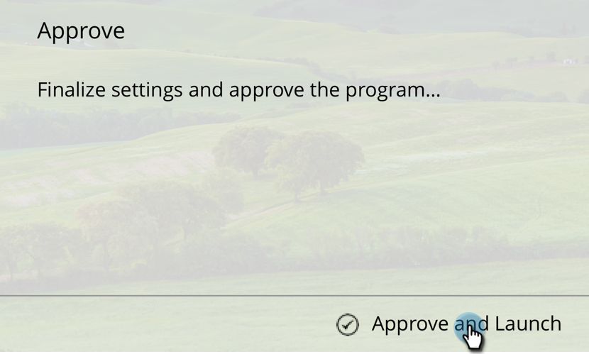
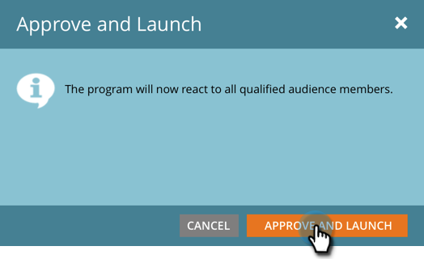
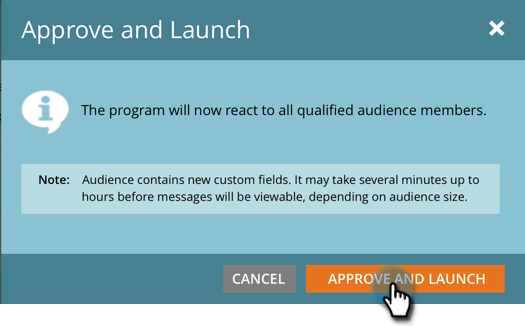
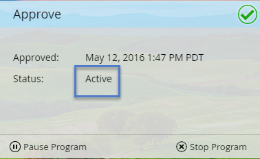
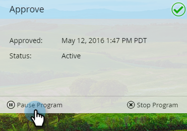
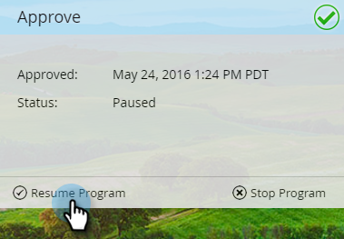
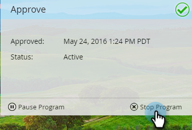
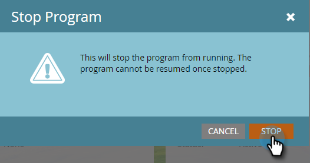

# Approuver votre message in-app {#approve-your-in-app-message}

Vous devez approuver l’envoi avant que le message in-app ne soit envoyé.

1. Si tout semble correct, cliquez sur **[!UICONTROL Approuver et lancer]**.

   

   >[!NOTE]
   >
   >Si une partie du processus d’envoi est incomplète, par exemple si le message in-app n’est pas approuvé, un message d’avertissement s’affiche, indiquant quelle zone nécessite votre attention. Pour résoudre ce problème, vous devriez voir le message à l’étape 2.

1. Cliquez sur **[!UICONTROL Approuver et lancer]**.

   

1. Si vous avez utilisé des champs personnalisés, l’exécution de Marketo peut prendre plus de temps et affichera ce message à la place.

   

1. Le message est maintenant « [!UICONTROL &#x200B; Actif &#x200B;].

   

   >[!NOTE]
   >
   >Il faut normalement entre 15 et 30 minutes pour qu’un message in-app approuvé soit visible par les visiteurs de votre programme. N’oubliez pas que si vous utilisez des champs personnalisés, cette opération peut prendre plusieurs heures, voire plus.

   Vous pouvez suspendre ou arrêter un programme actif, mais il y a une grande différence entre ces deux options.

1. Cliquez sur **[!UICONTROL Suspendre le programme]** si vous devez arrêter le programme pendant un certain temps mais le reprendre ultérieurement. Le statut passe à **[!UICONTROL En pause]**.

   

   >[!NOTE]
   >
   >Une suspension peut être simplement arrêtée pendant un certain temps, ou si vous souhaitez modifier le message ou ajuster le planning. Cependant, vous ne pouvez pas passer à un autre message, mais uniquement modifier le message existant.

1. Pour que le programme en pause continue à s’exécuter, cliquez sur **[!UICONTROL Reprendre le programme]**.

   

1. Pour arrêter complètement le programme, cliquez sur **[!UICONTROL Arrêter le programme]**.

   

1. Si vous voulez vraiment arrêter le programme, cliquez sur **[!UICONTROL Arrêter]**.

   

   >[!NOTE]
   >
   >Lorsque vous arrêtez un programme, il ne s’exécute plus et ne peut pas être repris. Si vous voulez l&#39;exécuter à nouveau, vous devrez le reconstruire. Ainsi, assurez-vous d&#39;avoir terminé avec un programme avant de cliquer sur **[!UICONTROL Arrêter le programme]** !

## Tableau De Bord In-App {#in-app-dashboard}

Une fois votre programme exécuté, vous pouvez surveiller ses performances à l’aide du tableau de bord In-App, qui s’affiche automatiquement après votre approbation du programme. Pour revenir au programme, cliquez sur le lien en haut à droite et sélectionnez **[!UICONTROL Panneau de Contrôle]**.

C&#39;est tout !
