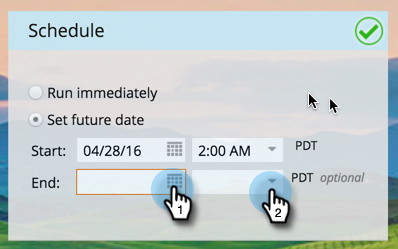

# Planifier votre message in-app {#schedule-your-in-app-message}

Envoyez votre message maintenant ou planifiez-le pour plus tard.

1. Pour planifier un message in-app, sélectionnez **[!UICONTROL Définir la date future]** et choisissez une date de début dans le calendrier déroulant.

   

1. Sélectionnez une heure de début dans la liste déroulante.

   

1. La Date et l’heure de fin sont facultatives ; sélectionnez-les dans les listes déroulantes.

   

1. Pour exécuter le programme maintenant, sélectionnez **[!UICONTROL Exécuter immédiatement]**. Les champs Date de début disparaissent.

   

Doucement ! Enfin et surtout, l’étape [Approbation](/help/marketo/product-docs/mobile-marketing/in-app-messages/sending-your-in-app-message/approve-your-in-app-message.md).
