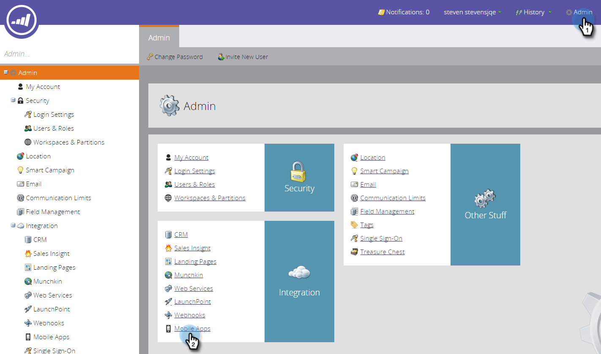

# Ajouter un nouveau périphérique de test {#adding-a-new-test-device}

Il est facile d’ajouter un nouveau périphérique de test auquel envoyer des notifications Push.

>[!NOTE]
>
>**Autorisations d’administrateur requises**

1. Cliquez sur **Admin **puis sur le lien **Applications mobiles**.\
   

1. Cliquez sur l&#39;onglet **Périphériques de test** et **Nouveau périphérique de test**.

   

1. Sélectionnez votre application.

   

1. Vous pouvez connecter votre périphérique à l’application de deux manières.

   Avec la première option, il vous suffit de copier l’URL à partir du champ et de l’envoyer dans un message électronique ou texte à votre périphérique. Sur le périphérique, appuyez sur l’URL.

   

   Ou, avec la deuxième option, cliquez sur le deuxième bouton et analysez le code QR avec votre périphérique.

   

1. L’application s’ouvre. Nommez le périphérique et appuyez sur **Oui**.

   

   Succès !

   

1. Le statut est mis à jour pour afficher le périphérique. Félicitations !

   

