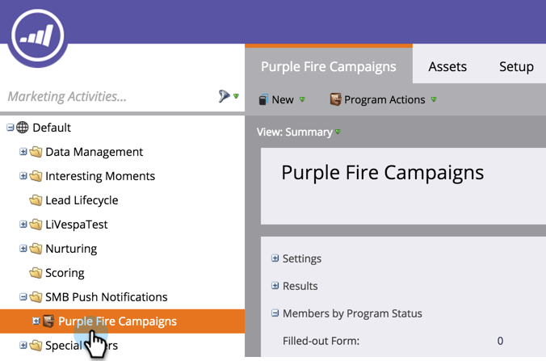
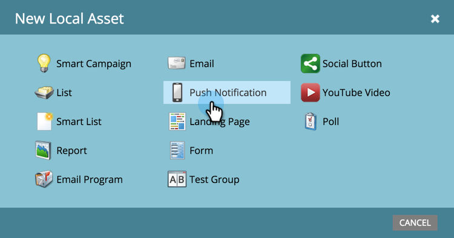

# Créer une notification push {#create-a-push-notification}

Il est facile de créer une notification push. Cependant, avant de commencer, vous devez demander à votre administrateur Marketo et à votre développeur d’applications mobiles de configurer certains éléments dont vous aurez besoin pendant que vous le faites. Voir [Présentation des notifications push](/help/marketo/product-docs/mobile-marketing/push-notifications/understanding-push-notifications.md) pour plus d’informations.

1. Accédez à la zone **[!UICONTROL Activités marketing]**.

   

1. Recherchez et sélectionnez votre programme.

   

1. Sous **[!UICONTROL Nouveau]**, cliquez sur **[!UICONTROL Nouvelle ressource locale]**.

   

1. Sélectionnez **[!UICONTROL Notification push]**.

   

1. Saisissez un **Nom de la notification push** et cliquez sur **[!UICONTROL Créer]**.

   

   Doux ! Maintenant que la notification push est créée, allons-y et [habillez-la](/help/marketo/product-docs/mobile-marketing/push-notifications/configure-mobile-push-notification.md).
