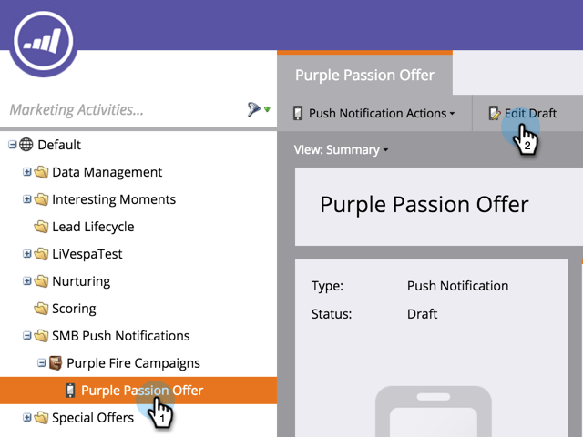

# Modifier la notification Push mobile {#edit-mobile-push-notification}

1. Accédez à la zone Activités marketing.

1. Sélectionnez votre application mobile, puis cliquez sur Modifier le brouillon.

   

>[!NOTE]
>
>**Plongée profonde**
>
>Pour en savoir plus sur [la configuration des notifications Push](configure-mobile-push-notification.md) ici.

