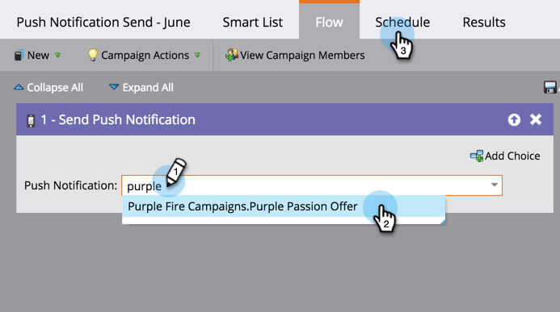
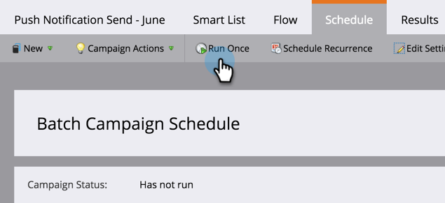

# Envoyer une notification Push mobile {#send-a-mobile-push-notification}

Envoyez une notification Push aux utilisateurs de votre application mobile.

>[!PREREQUISITES]
>
>* [Créer une Campaign intelligente](../../../product-docs/core-marketo-concepts/smart-campaigns/creating-a-smart-campaign/create-a-new-smart-campaign.md)
>* [Créer une notification Push](create-a-push-notification.md)

>

1. Accédez à la zone **Activités marketing**.

   

1. Sélectionnez votre campagne intelligente et cliquez sur **Liste intelligente**.

   

1. Définissez votre liste intelligente, puis cliquez sur **FLUX.**

   

1. Sélectionnez une notification Push. Cliquez sur **Planification**

   

   >[!NOTE]
   >
   >La notification Push doit être approuvée avant d’apparaître dans la liste déroulante.

1. Cliquez sur **Exécuter une fois**

   

1. Choisissez une date et une heure. Cliquez sur **SAVE.**

   

Asseyez-vous et attendez que votre notification Push sorte.