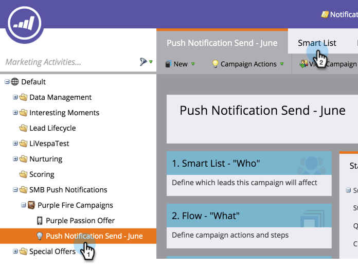
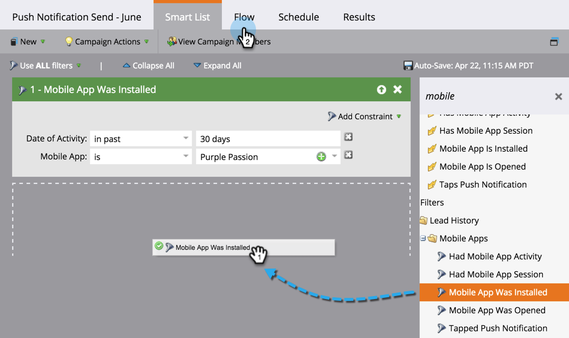

# Envoyer une notification push pour mobile {#send-a-mobile-push-notification}

Envoyer une notification push aux personnes qui utilisent votre application mobile.

>[!PREREQUISITES]
>
>* [Créer une campagne intelligente](/help/marketo/product-docs/core-marketo-concepts/smart-campaigns/creating-a-smart-campaign/create-a-new-smart-campaign.md)
>* [Créer une notification push](/help/marketo/product-docs/mobile-marketing/push-notifications/create-a-push-notification.md)

1. Accédez à la zone **[!UICONTROL Activités marketing]**.

   

1. Sélectionnez votre campagne dynamique et cliquez sur **[!UICONTROL Liste dynamique]**.

   

1. Définissez votre liste dynamique, puis cliquez sur **[!UICONTROL Flux]**.

   

1. Sélectionnez une notification push. Cliquez sur **[!UICONTROL Planifier]**.

   

   >[!NOTE]
   >
   >La notification push doit être approuvée avant d&#39;apparaître dans la liste déroulante.

1. Cliquez sur **[!UICONTROL Exécuter une fois]**.

   

1. Choisissez une date et une heure. Cliquez sur **[!UICONTROL Enregistrer]**

   

Asseyez-vous et attendez que votre notification push soit envoyée.
