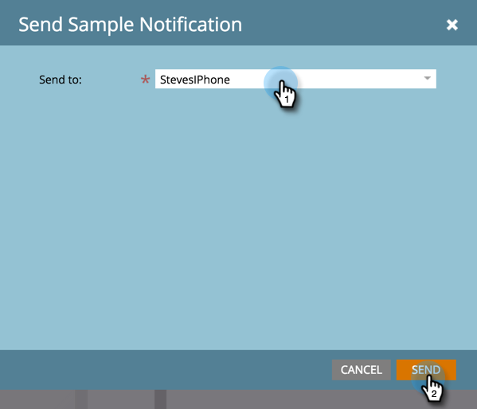

# Envoi d’un exemple de notification push {#send-a-push-notification-sample}

Vous pouvez envoyer un exemple pour vérifier que votre notification push fonctionne correctement !

>[!PREREQUISITES]
>
>Assurez-vous que l’application est installée sur l’appareil sur lequel vous envoyez l’exemple.

1. Vous pouvez envoyer un exemple de trois façons :

   Dans l’arborescence de gauche, cliquez avec le bouton droit sur la ressource de notification push et cliquez sur **Envoyer l’exemple**.

   

   Ou, dans le menu des actions Notification push , cliquez sur **Envoyer l’exemple**.

   

   Ou, dans l’éditeur de notifications push, cliquez sur **Envoyer un exemple**.

   

1. Si vous avez déjà configuré l’appareil de test à utiliser, sélectionnez-le dans la liste.

   

   Ou cliquez sur **Ajouter un périphérique** pour [ajouter un nouvel appareil de test](/help/marketo/product-docs/mobile-marketing/push-notifications/adding-a-new-test-device.md) pour envoyer l’exemple.

   

1. Vous pouvez connecter votre appareil à l’application de deux manières différentes.

   Avec la première option, cliquez sur le bouton **Visiter l’URL avec l’appareil** , copiez l’URL du champ et envoyez-la dans un message électronique ou texte sur votre appareil. Sur l’appareil, appuyez sur l’URL. Lorsque l’état affiche la connexion, cliquez sur **Envoyer**.

   

   Ou, avec la deuxième option, cliquez sur le bouton **Analyser le code QR avec l’appareil** et analysez le code QR avec votre appareil. Lorsque l’état affiche la connexion, cliquez sur **Envoyer**.

   

   >[!TIP]
   >
   >Avez-vous correctement ajouté un périphérique de test, mais ne le voyez pas répertorié dans le champ **Envoyer à** ? Pour résoudre les problèmes, vérifiez les points suivants :
   >
   >* Les notifications push sont activées pour l’application associée à la notification push.
   >
   >* La notification push est configurée pour la plateforme de votre appareil de test. Par exemple, si vous venez d’ajouter iPhone en tant qu’appareil de test, assurez-vous que la notification push est activée pour iOS.

Facile !
