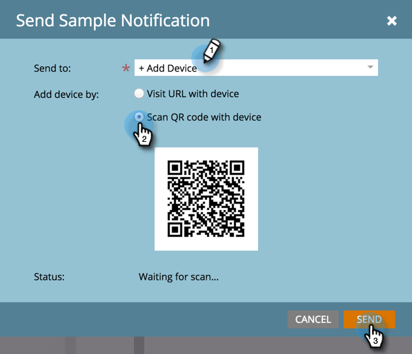

# Envoyer un exemple de notification push {#send-a-push-notification-sample}

Vous pouvez envoyer un exemple pour vérifier que votre notification push fonctionne correctement.

>[!PREREQUISITES]
>
>Assurez-vous que l’application est installée sur l’appareil auquel vous envoyez l’exemple.

1. Vous pouvez envoyer un exemple de trois façons :

   Dans l’arborescence de gauche, cliquez avec le bouton droit sur la ressource de notification push, puis cliquez sur **[!UICONTROL Envoyer un exemple]**.

   

   Ou, dans le menu Actions de notification push, cliquez sur **[!UICONTROL Envoyer un exemple]**.

   

   Ou, dans l’éditeur de notifications push, cliquez sur **[!UICONTROL Envoyer un exemple]**.

   

1. Si vous avez déjà configuré l’appareil de test que vous souhaitez utiliser, il vous suffit de le sélectionner dans la liste.

   

   Ou cliquez sur **[!UICONTROL Ajouter un appareil]** pour [ajouter un nouvel appareil de test](/help/marketo/product-docs/mobile-marketing/push-notifications/adding-a-new-test-device.md) et envoyer l’échantillon à .

   

1. Vous pouvez connecter votre appareil à l’application de deux manières différentes.

   Avec la première option, cliquez sur le bouton **[!UICONTROL Visiter l’URL avec l’appareil]**, copiez l’URL à partir du champ et envoyez-la dans un e-mail ou un message texte à votre appareil. Sur l’appareil, appuyez sur l’URL. Lorsque le statut affiche la connexion, cliquez sur **[!UICONTROL Envoyer]**.

   

   Ou, avec la deuxième option, cliquez sur le bouton **[!UICONTROL Scanner le code QR avec l’appareil]** et scannez le code QR avec votre appareil. Lorsque le statut affiche la connexion, cliquez sur **[!UICONTROL Envoyer]**.

   

   >[!TIP]
   >
   >Avez-vous correctement ajouté un appareil de test, mais il n’est pas répertorié dans le champ **[!UICONTROL Envoyer à]** ? Vérifiez ces éléments pour résoudre le problème :
   >
   >* Les notifications push sont activées pour l’application qui y est associée.
   >
   >* La notification push est configurée pour la plateforme de votre appareil de test. Par exemple, si vous venez d’ajouter un iPhone en tant qu’appareil de test, assurez-vous que la notification push est activée pour iOS.

Doucement !
