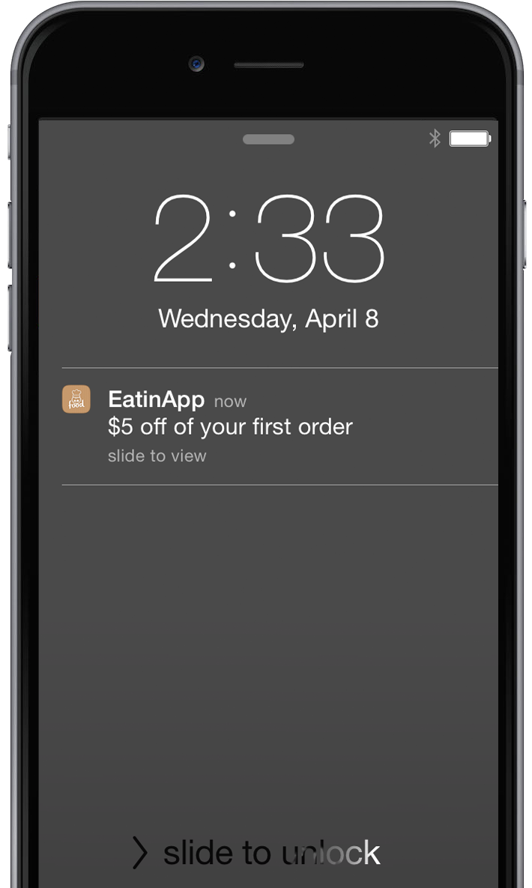

# Présentation des notifications push {#understanding-push-notifications}

>[!NOTE]
>
>La messagerie in-app est une application complémentaire. Confirmez auprès de votre gestionnaire de compte Marketo pour vous assurer qu’il est activé.

L’engagement mobile de Marketo vous permet de créer, configurer et envoyer une notification comme vous le feriez pour créer un email.  Avant de pouvoir créer et envoyer des notifications push à partir de votre application mobile, vous aurez besoin de votre administrateur Marketo et de votre développeur d’applications mobiles pour effectuer certaines configurations.

>[!CAUTION]
>
>Les notifications push sont un module complémentaire qui doit être activé par un administrateur Marketo avant de commencer.

## Étape 1 : administrateur et développeur réalisent les configurations initiales {#step-admin-and-developer-perform-initial-setups}

Les administrateurs Marketo et les développeurs d’applications mobiles travaillent ensemble pour vous configurer. Pour plus d’informations, voir [Avant de créer des notifications push et des messages In-App](/help/marketo/product-docs/mobile-marketing/admin/before-you-create-push-notifications-and-in-app-messages.md) .

## Étape 2 : création d’une notification push {#step-create-a-push-notification}

[Créez votre message](/help/marketo/product-docs/mobile-marketing/push-notifications/create-a-push-notification.md) et prévisualisez son affichage sur les appareils Android et iOS.

## Étape 3 : Envoyer ! {#step-send}

[Les notifications push peuvent être envoyées](/help/marketo/product-docs/mobile-marketing/push-notifications/send-a-mobile-push-notification.md) à l’aide de campagnes déclencheuses et dynamiques par lots. Plutôt cool, hein ?

>[!NOTE]
>
>* Une notification push ne s’affiche pas à l’écran tant que l’application n’a pas été ouverte au moins une fois.
>* Pour les applications iOS, une notification push ne s’affiche pas à l’écran si l’application désignée pour recevoir le message push est ouverte et active. À la place, le message s’affiche dans la zone de notifications locale de l’application.
