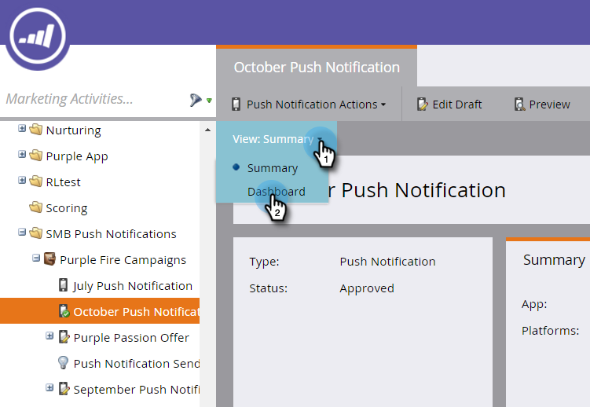

# Afficher le tableau de bord des notifications push {#view-the-push-notification-dashboard}

Il est facile de voir comment se portent vos notifications push.

1. Accédez à la zone **[!UICONTROL Activités marketing]**.

   

1. Sélectionnez votre campagne.

   

1. Cliquez sur **[!UICONTROL Afficher : Résumé]** puis sélectionnez **[!UICONTROL Tableau de bord]**.

   

1. Vous pouvez afficher les valeurs [!UICONTROL Total envoyé] et [!UICONTROL Total des appuis] pour iOS et Android dans des graphiques circulaires. Faites défiler la page vers le bas pour afficher [!UICONTROL Appuyez sur Atténuation] dans les graphiques à barres.

   

   >[!NOTE]
   >
   >La mesure _Envoyés_ peut refléter plus d’envois que le nombre exact de personnes auxquelles la notification push a été envoyée. En effet, il est calculé en fonction du _nombre d’appareils_ qui remplissent les critères pour recevoir votre notification push. Par exemple, si une seule personne dispose de trois appareils, le tableau de bord enregistre trois envois, et non un seul.

   >[!MORELIKETHIS]
   >
   >* [Présentation des notifications push](/help/marketo/product-docs/mobile-marketing/push-notifications/understanding-push-notifications.md)
   >* [Envoyer une notification push mobile](/help/marketo/product-docs/mobile-marketing/push-notifications/send-a-mobile-push-notification.md)
