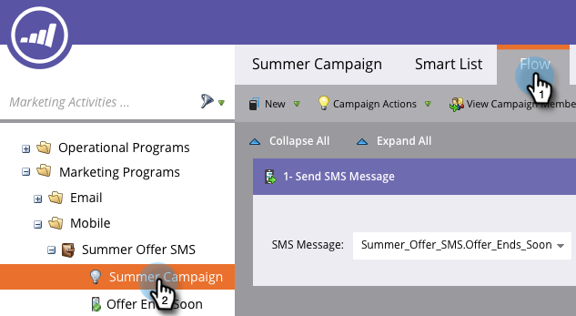

# Ajouter une étape de flux pour SMS {#add-a-flow-step-for-sms}

Marketo comprend trois étapes de flux que vous pouvez utiliser dans vos campagnes intelligentes SMS :

* **Envoyer un message**  SMS - Cette action de flux envoie des messages à des personnes de la liste de base marketing qui sont abonnées à une liste d&#39;abonnement Vibes sélectionnée par l&#39;utilisateur. Il ne lance pas le processus d&#39;abonnement.
* **S&#39;abonner à la Liste**  Vibes - Cette action de flux lance le processus d&#39;abonnement SMS via un Campaign d&#39;acquisition Vibes sélectionné par l&#39;utilisateur. Vibes envoie alors un message de confirmation ; le destinataire doit y répondre pour terminer le processus d&#39;abonnement.
* **Désabonner de la Liste**  Vibes - Cette action de flux désabonne chaque personne d&#39;une liste d&#39;abonnement Vibes sélectionnée par l&#39;utilisateur.

>[!NOTE]
>
>Lors de l&#39;envoi de messages SMS :
>
>* Le marketing déduplique par numéro de téléphone. Ainsi, si plusieurs personnes ont le même numéro de téléphone, une seule personne recevra le message.
>* Le marketing n’est pas envoyé aux personnes qui sont placées sur la liste bloquée ou dont le marketing est suspendu.

>

Pour des informations générales sur la configuration des étapes de flux, voir [Ajouter une étape de flux à une Campaign dynamique](../../../product-docs/core-marketo-concepts/smart-campaigns/flow-actions/add-a-flow-step-to-a-smart-campaign.md).

Voici les bases de l&#39;utilisation des SMS.

1. Dans Mon marketing, cliquez sur **Activités marketing**.

   

1. Recherchez la campagne intelligente à laquelle vous souhaitez ajouter le flux SMS. Cliquez sur l&#39;onglet **Flux**.

   

1. Faites glisser le curseur sur le flux, par exemple **Envoyer un message SMS**. Sélectionnez le message SMS et la liste Vibes dans les listes déroulantes.

   

   >[!NOTE]
   >
   >Le sélecteur de Liste Vibes agit comme un filtre supplémentaire vers l&#39;audience déjà identifiée dans la liste intelligente pour cible uniquement les pistes qui appartiennent à cette liste Vibes.
   >
   >
   >Les flux **S’abonner à la Liste Vibes** et **Se désabonner de la Liste Vibes** ont des exigences différentes. Pour **S’abonner**, vous devez sélectionner la liste Vibes et la campagne d’acquisition Vibes. Pour **Se désabonner**, seule la liste Vibes est requise.

