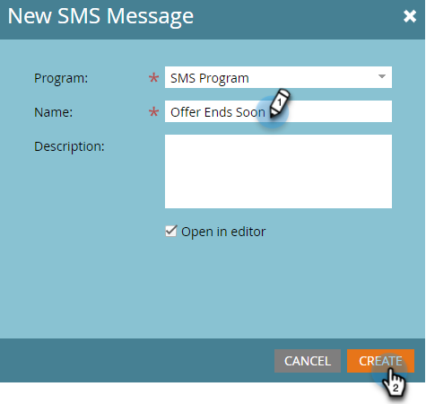

# Créer un message SMS {#create-an-sms-message}

Voici comment créer un SMS.

>[!AVAILABILITY]
>
>Cette fonctionnalité est disponible en tant que module complémentaire pour votre compte Adobe Marketo Engage. Pour qu’il soit correctement configuré, il doit être acheté par Adobe. Pour plus d’informations, contactez l’équipe de compte d’Adobe (votre gestionnaire de compte). Marketo Vibes L’intégration native SMS est disponible aux États-Unis et au Canada. Pour les autres pays, une connexion via les webhooks Marketo peut être utilisée par [contact direct de vidéos](https://www.vibes.com/talk-to-sales).

>[!PREREQUISITES]
>
>[Ajout de vidéos en tant que service LaunchPoint](/help/marketo/product-docs/mobile-marketing/admin/add-vibes-as-a-launchpoint-service.md){target="_blank"}

1. Accédez à **[!UICONTROL Activités marketing]**.

   

1. Cliquez avec le bouton droit de la souris sur le programme de votre choix, puis sélectionnez **[!UICONTROL Nouvelle ressource locale]**.

   

1. Sélectionner **SMS Message**.

   

1. Saisissez un nom et une description facultative pour le nouveau SMS, puis cliquez sur **Créer**.

   

1. Dans l’éditeur, cliquez à l’intérieur de la bulle bleue et commencez à saisir du texte.

   

   >[!NOTE]
   >
   >La limite de caractères d&#39;un SMS est de 160 caractères à l&#39;aide du jeu de caractères ASCII standard. Si vous dépassez 160 caractères, votre message sera fractionné en fonction du nombre total de caractères.

1. Pour ajouter un jeton à votre message, écrivez un message rapide et cliquez sur **Jeton**.

   

   >[!NOTE]
   >
   >L’ajout d’un jeton peut provoquer le dépassement de la limite de caractères du message. Le message se divise ensuite, créant ainsi un message supplémentaire.

   >[!IMPORTANT]
   >
   >Conformité SMS : tous les SMS sortants doivent inclure le nom de la marque ou la description du programme. Les instructions HELP et STOP doivent être fournies au moins une fois par mois et par abonné pour les programmes de messages récurrents.

1. Sélectionnez la **Jeton**, saisissez une valeur facultative **Valeur par défaut**, puis cliquez sur **Créer**.

   

1. Pour ajouter un lien, sélectionnez l’emplacement dans le message où il doit apparaître, puis cliquez sur **Lien**.

   

1. Sélectionnez un type de lien. La page d’entrée Marketo est la page par défaut. Si vous optez pour cette méthode, cliquez sur la liste déroulante Landing Page et sélectionnez la page souhaitée. Cliquez sur **Insérer** une fois terminé.

   

   >[!NOTE]
   >
   >Les deux liens de tracking sont sélectionnés par défaut. Si vous décochez uniquement l’option Inclure mkt_tok , le lien sera toujours suivi, mais après la redirection, l’URL de destination n’inclura pas le paramètre de chaîne de requête mkt_tok. Ce paramètre est utilisé par les pages d’entrée Marketo et Munchkin pour assurer un suivi correct des activités des personnes (comme lorsqu’une personne s’exclut).

1. Si vous souhaitez utiliser une URL externe à la place, sélectionnez **URL externe**, saisissez/collez l’URL, puis cliquez sur **Insérer**.

   

   >[!NOTE]
   >
   >Lorsque l’option &quot;Lien de suivi&quot; est sélectionnée, Marketo modifie automatiquement l’URL à des fins de suivi. Si vous optez pour la désactivation du tracking, l’URL n’apparaîtra pas dans le message (par exemple, `www.adobe.com`).

   >[!CAUTION]
   >
   >Il est recommandé de _not_ utilisez des réducteurs d’URL (par exemple, Bisément), car les opérateurs peuvent signaler votre message comme indésirable.

1. Le lien s’affiche dans le message.

   

   >[!NOTE]
   >
   >Marketo affiche un aperçu des liens du domaine de suivi de marque. Si vous décochez la case du lien mkt_tok, le lien est modifié.

Si vous insérez plus de 160 caractères, l&#39;éditeur divise votre SMS en sections. La limite globale est de 900 caractères par message. Si vous dépassez cette limite, le message sera tronqué lors de la diffusion.
