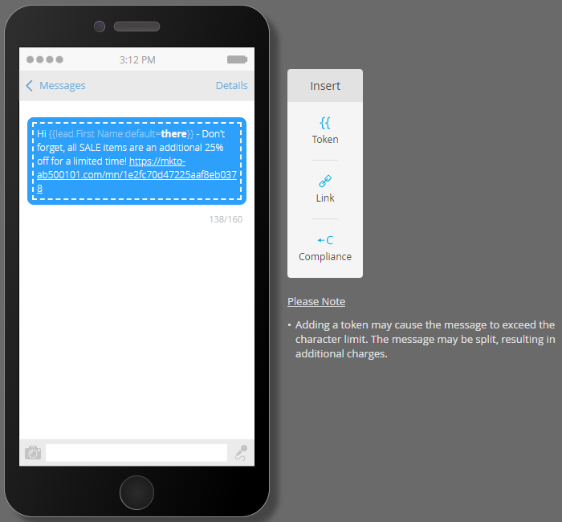

# Créer un message SMS {#create-an-sms-message}

Voici comment créer un SMS.

>[!AVAILABILITY]
>
>Cette fonctionnalité est disponible sous la forme d’un module complémentaire pour votre compte Adobe Marketo Engage. Pour qu’il soit correctement configuré, il doit être acheté via Adobe. Pour plus d’informations, contactez l’équipe du compte Adobe (votre gestionnaire de compte). L’intégration native des SMS Marketo Vibes est disponible aux États-Unis et au Canada. Pour les autres pays, une connexion via les Webhooks Marketo peut être utilisée en [contactant directement Vibes](https://www.vibes.com/talk-to-sales).

>[!PREREQUISITES]
>
>[Ajouter Vibes as a LaunchPoint Service](/help/marketo/product-docs/mobile-marketing/admin/add-vibes-as-a-launchpoint-service.md){target="_blank"}

1. Accédez à **[!UICONTROL Activités marketing]**.

   

1. Faites un clic droit sur le programme souhaité et sélectionnez **[!UICONTROL Nouvelle ressource locale]**.

   

1. Sélectionnez **Message SMS**.

   

1. Saisissez un nom et une description facultative pour le nouveau SMS, puis cliquez sur **Créer**.

   

1. Dans l’éditeur, cliquez dans la bulle bleue et commencez à saisir du texte.

   

   >[!NOTE]
   >
   >La limite de caractères pour un SMS est de 160 caractères avec le jeu de caractères ASCII standard. Si vous dépassez 160 caractères, votre message sera fractionné en fonction du nombre total de caractères.

1. Pour ajouter un jeton dans votre message, écrivez un message d’accueil rapide et cliquez sur **Jeton**.

   

   >[!NOTE]
   >
   >L’ajout d’un jeton peut provoquer le dépassement de la limite de caractères du message. Le message est alors fractionné, ce qui crée un message supplémentaire.

   >[!IMPORTANT]
   >
   >Conformité des SMS : tous les SMS sortants doivent inclure le nom de la marque ou la description du programme. Les instructions HELP et STOP doivent être fournies au moins une fois par mois par abonné pour les programmes de messages récurrents.

1. Sélectionnez le **Jeton** souhaité, saisissez une valeur facultative **Valeur par défaut**, puis cliquez sur **Créer**.

   

1. Pour ajouter un lien, sélectionnez l’endroit où vous souhaitez qu’il apparaisse dans le message et cliquez sur **Lien**.

   

1. Sélectionnez un type de lien. La page de destination de Marketo est la valeur par défaut. Si vous choisissez cette option, cliquez sur le menu déroulant Page de destination et sélectionnez la page souhaitée. Cliquez sur **Insérer** lorsque vous avez terminé.

   

   >[!NOTE]
   >
   >Les deux liens de tracking sont sélectionnés par défaut. Le fait de décocher la case Inclure uniquement mkt_tok permet toujours le suivi du lien, mais après redirection, l’URL de destination n’inclut pas le paramètre de chaîne de requête mkt_tok. Ce paramètre est utilisé par les pages de destination et Munchkin de Marketo pour assurer un suivi correct des activités des personnes (comme lorsqu’une personne se désinscrit).

1. Si vous souhaitez utiliser une URL externe à la place, sélectionnez **URL externe**, saisissez/collez l’URL, puis cliquez sur **Insérer**.

   

   >[!NOTE]
   >
   >Lorsque vous conservez la sélection « Lien de suivi », Marketo modifie automatiquement l’URL à des fins de suivi. Si vous choisissez de désactiver le suivi, l’URL s’affichera dans le message sous forme inchangée (par exemple, `www.adobe.com`).

   >[!CAUTION]
   >
   >Il est recommandé de _ne pas_ utiliser de raccourcisseurs d’URL (par exemple, Bited), car les opérateurs peuvent marquer votre message comme étant du spam.

1. Le lien s’affiche dans le message.

   

   >[!NOTE]
   >
   >Marketo affiche un aperçu du lien du domaine de suivi de marque. Si vous décochez la case mkt_tok link, le lien est modifié.

Si vous insérez plus de 160 caractères, l’éditeur divise votre SMS en sections. La limite globale est de 900 caractères par message. Si vous dépassez ce délai, le message sera tronqué à la diffusion.
