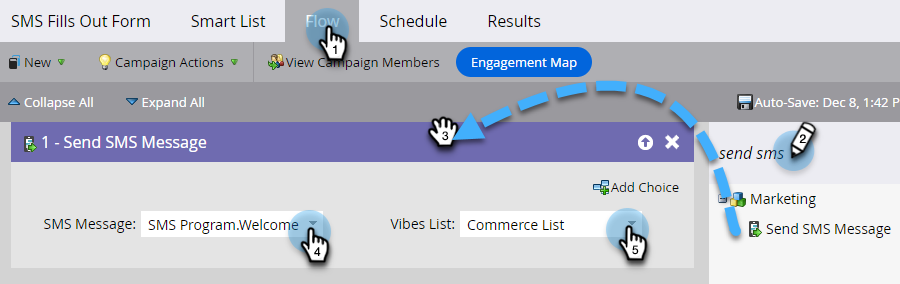

# Envoyer un message SMS {#send-a-vibes-sms-message}

Vous avez [créé votre SMS](/help/marketo/product-docs/mobile-marketing/vibes-sms-messages/create-an-sms-message.md){target="_blank"}, il est maintenant temps de l’envoyer. Vous pouvez l’envoyer par le biais d’une campagne Batch ou Trigger.

>[!NOTE]
>
>Lors de l’envoi de SMS :
>
>* Marketo Engage déduplique par numéro de téléphone. Ainsi, si plusieurs personnes ont le même numéro de téléphone, une seule personne recevra le message si elle est membre d&#39;une seule liste d&#39;abonnements Vibes. Le dédoublonnage est effectué au niveau de la liste d’abonnements Vibes, et non au niveau du programme Marketo.
>* Marketo placer sur la liste bloquée n’enverra pas de messages aux personnes qui sont bloquées ou dont le marketing est suspendu.
>* Un SMS ne sera envoyé à personne désabonnée si elle ne figure pas dans la liste Base de données mobile Vibes.

## Envoyer un SMS par lot {#send-a-batch-sms}

1. Dans Mon Marketo, cliquez sur **Activités marketing**.

   

1. Recherchez et sélectionnez la campagne intelligente souhaitée.

   

1. Cliquez sur l’onglet **Liste dynamique** et définissez l’audience du SMS. Dans cet exemple, nous envoyons à toutes les personnes de notre base de données dont la société « Adobe » est répertoriée.

   

1. Dans l’onglet **Flux**, faites glisser sur **Envoyer un SMS**. Sélectionnez le SMS souhaité et la liste Vibes dans les listes déroulantes.

   

   >[!NOTE]
   >
   >Le sélecteur de liste Vibes agit comme un filtre supplémentaire sur l’audience déjà identifiée dans la liste dynamique afin de cibler uniquement les personnes appartenant à cette liste Vibes.

1. Cliquez sur l’onglet **Planifier** et planifiez votre SMS.

   

## Envoyer un SMS de déclenchement {#send-a-trigger-sms}

1. Dans Mon Marketo, cliquez sur **Activités marketing**.

   

1. Recherchez et sélectionnez la campagne intelligente souhaitée.

   

1. Cliquez sur l’onglet **Liste dynamique**, sélectionnez le déclencheur souhaité et définissez sa valeur. Dans cet exemple, nous utilisons **Remplit le formulaire**.

   

1. Dans l’onglet **Flux**, faites glisser sur **Envoyer un SMS**. Sélectionnez le SMS souhaité et la liste Vibes dans les listes déroulantes.

   

   >[!NOTE]
   >
   >Le sélecteur de liste Vibes agit comme un filtre supplémentaire sur l’audience déjà identifiée dans la liste dynamique afin de cibler uniquement les personnes appartenant à cette liste Vibes.

1. Cliquez sur l&#39;onglet **Planifier**, puis **Activer**.

   

>[!MORELIKETHIS]
>
>* [Créer un message Vibes](/help/marketo/product-docs/mobile-marketing/vibes-sms-messages/create-an-sms-message.md){target="_blank"}
>* [Utilisation des options SMS dans une campagne dynamique](/help/marketo/product-docs/mobile-marketing/vibes-sms-messages/using-sms-options-in-a-smart-campaign.md){target="_blank"}
