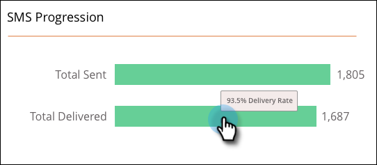

# Rapports SMS {#sms-reporting}

Le tableau de bord des messages SMS fournit des analyses utiles sur vos messages.

## Accès au tableau de bord {#access-the-dashboard}

1. Pour afficher le rapport, sélectionnez le SMS souhaité. Cliquez sur la liste déroulante **Afficher** et sélectionnez **Tableau de bord**.

   

1. Le tableau de bord s’affiche.

   

## Présentation du tableau de bord {#dashboard-overview}

### Progression des SMS {#sms-progression}

Affiche le total envoyé et le total diffusé. Les montants sont à droite. Si vous passez la souris sur une barre, le pourcentage est affiché.

### Résumé {#summary}

Affiche le taux de rebond calculé sous forme de pourcentage. Passez la souris sur la barre supérieure pour afficher le taux de diffusion par montant et pourcentage. Passez la souris sur la section Taux de rebond orange de la barre pour afficher les montants/pourcentages des taux de rebond (soft et hard).

### Activity Over Time {#activity-over-time}

Permet de sélectionner Total envoyé ou Total diffusé. Sélectionnez une plage appropriée dans le sélecteur de période.

