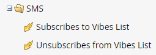

# Utilisation des options SMS dans une campagne dynamique {#using-sms-options-in-a-smart-campaign}

Après vous [créer un SMS ;](/help/marketo/product-docs/mobile-marketing/vibes-sms-messages/create-an-sms-message.md){target="_blank"}, vous souhaitez utiliser des déclencheurs et des filtres de liste dynamique dans une campagne dynamique pour en tirer parti.

>[!NOTE]
>
>Si vous souhaitez envoyer un SMS, nous avons un [article spécifique](/help/marketo/product-docs/mobile-marketing/vibes-sms-messages/send-an-sms-message.md){target="_blank"} pour cela.

>[!PREREQUISITES]
>
>Les déclencheurs/filtres SMS n’apparaissent que si la variable [Le service Vibes a été activé](/help/marketo/product-docs/mobile-marketing/admin/add-vibes-as-a-launchpoint-service.md){target="_blank"}.

## Triggers SMS {#sms-triggers}

<table style="width:600px">
  <tr>
    <td style="width:50%"></td>
    <td style="width:50%"></td>
  </tr>
</table>

Voici quelques exemples :

La variable **SMS Message Bounces** déclenche un flux, tel que l’envoi d’un email, lorsqu’un SMS rebondit.

La variable **S’abonne à la liste des vidéos** déclenche un flux lorsqu’une personne s’abonne.

La variable **Clics sur le lien dans un message SMS** déclenche un flux lorsqu’une personne clique sur un lien dans le SMS.

## Filtres SMS {#sms-filters}

<table style="width:600px">
  <tr>
    <td style="width:50%"></td>
    <td style="width:50%"></td>
  </tr>
</table>

La variable **Abonné à la liste des vidéos** filtre recherche quiconque possède *ever* abonné à Vibes. Cela inclut les personnes désabonnées et supprimées, même si les personnes supprimées sont omises du flux. Ce filtre est mieux adapté à la création de rapports.

En revanche, la variable **Membre de la liste des vidéos** filter find _any_ actuellement abonné à Vibes et convient le mieux aux campagnes ou listes dynamiques.

>[!NOTE]
>
>Tous les filtres SMS incluent la variable **Date de l’activité** contrainte par défaut.

## Étapes de flux de SMS {#sms-flow-steps}

Il existe trois étapes de flux SMS parmi lesquelles choisir.

<table>
<tbody>
  <tr>
    <td style="width:20%"><b>Envoyer un message SMS</b></td>
    <td>Cette action de flux envoie des messages aux personnes de la liste dynamique Marketo qui sont abonnées à une liste d’abonnements Vibes de souscription de l’utilisateur. Il ne lance pas le processus d’abonnement. <a href="/help/marketo/product-docs/mobile-marketing/vibes-sms-messages/send-an-sms-message.md">En savoir plus</a>.</td>
  </tr>

<tr>
    <td style="width:20%"><b>S’abonner à la liste Vibes</b></td>
    <td>Cette action de flux lance le processus d'inscription SMS via une campagne d'acquisition Vibes sélectionnée par l'utilisateur. Vibes envoie alors un message de confirmation, auquel le destinataire doit répondre avec "Y" dans les 24 heures pour confirmer l'opt-in. Une fois que l’utilisateur s’est inscrit, il deviendra membre de la liste d’abonnements Vibes associée.</td>
  </tr>
  <tr>
    <td style="width:20%"><b>Se désabonner de la liste Vibes</b></td>
    <td>Cette action de flux désabonne chaque personne de la liste d’abonnement Vibes de l’utilisateur. Lorsqu’un utilisateur envoie un SMS "STOP" à votre code, son enregistrement de personne est mis à jour pour indiquer qu’il n’est plus membre de la liste d’abonnement Vibes.</td>
  </tr>
  </tbody>
</table>

>[!NOTE]
>
>La variable **Abonnement à la liste des vidéos** et **Se désabonner de la liste Vibes** les flux ont des exigences différentes. Pour **Abonner**, vous devez sélectionner la liste Vibes et la campagne d&#39;acquisition Vibes . Pour **Désabonner**, seule la liste Vibes est requise.

>[!MORELIKETHIS]
>
>* [Envoyer un SMS](/help/marketo/product-docs/mobile-marketing/vibes-sms-messages/send-an-sms-message.md){target="_blank"}
>* [Définition d’une liste dynamique pour Smart Campaign | Déclencheur](/help/marketo/product-docs/core-marketo-concepts/smart-campaigns/creating-a-smart-campaign/define-smart-list-for-smart-campaign-trigger.md){target="_blank"}
>* [Définition d’une liste dynamique pour Smart Campaign | Lot](/help/marketo/product-docs/core-marketo-concepts/smart-campaigns/creating-a-smart-campaign/define-smart-list-for-smart-campaign-batch.md){target="_blank"}
