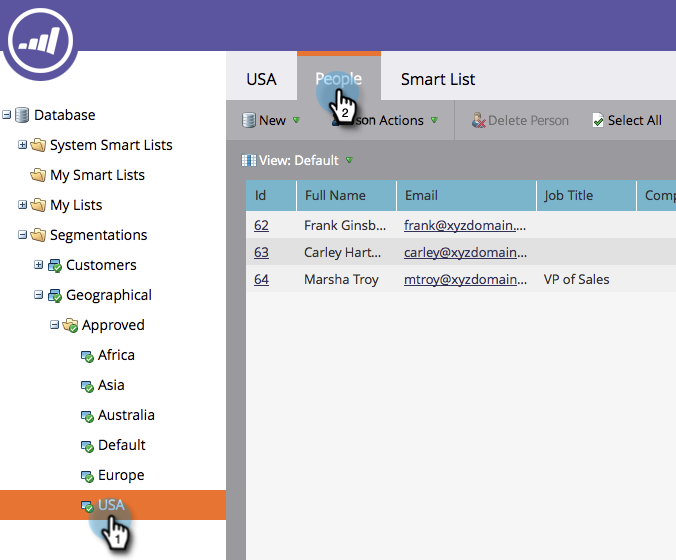

# Approbation d’une segmentation {#approve-a-segmentation}

Une segmentation doit être approuvée avant de pouvoir être utilisée.

>[!PREREQUISITES]
>
>* [Créer une segmentation](/help/marketo/product-docs/personalization/segmentation-and-snippets/segmentation/create-a-segmentation.md)
>* [Définition de règles de segment](/help/marketo/product-docs/personalization/segmentation-and-snippets/segmentation/define-segment-rules.md)

>[!NOTE]
>
>20 segments au maximum peuvent être approuvés à la fois.

1. Accédez à la **base de données**.

   

1. Dans la segmentation, cliquez sur **Actions de segmentation**, puis sur **Approuver**.

   

   >[!NOTE]
   >
   >L’état passe à Valider avec une roue tournante ( ) pendant que la validation est en cours.

   >[!CAUTION]
   >
   >Selon la taille de la base de données, la validation peut prendre plusieurs minutes à plus d’une journée.

   Une fois approuvé, le statut passe de Valider à Approuvé.
   

   >[!TIP]
   >
   >Le nombre de personnes dans chaque segment est indiqué entre parenthèses en regard du nom du segment.

1. L’onglet **Personnes** du **Segment** affiche désormais la liste finale des personnes pour le segment.

   

>[!CAUTION]
>
>Le nombre total de segments que vous pouvez créer dans une segmentation dépend du nombre et du type de filtres utilisés, ainsi que de la complexité de la logique de vos segments. Bien que vous puissiez créer jusqu’à 100 segments à l’aide de champs standard, l’utilisation d’autres types de filtres peut accroître la complexité et votre segmentation peut ne pas être approuvée. Voici quelques exemples : champs personnalisés, membres de la liste, champs du propriétaire de piste et étapes des recettes.
>
>Si vous recevez un message d’erreur lors de l’approbation et si vous avez besoin d’aide pour réduire la complexité de votre segmentation, contactez le [support Marketo](https://nation.marketo.com/t5/Support/ct-p/Support).

>[!MORELIKETHIS]
>
>[Utiliser des filtres de segments dans une liste dynamique](/help/marketo/product-docs/personalization/segmentation-and-snippets/segmentation/use-segment-filters-in-a-smart-list.md)
