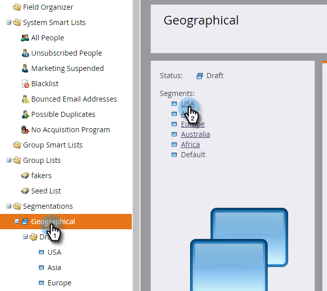

# Définir des règles de segment {#define-segment-rules}

La définition de règles de segmentation vous permet de classer vos personnes en différents groupes mutuellement exclusifs.

>[!PREREQUISITES]
>
>[Création d’une segmentation](create-a-segmentation.md)

1. Accédez à la **base de données.**

   

1. Cliquez sur **Segmentation **dans l&#39;arborescence, puis sur un **segment** particulier.

   

1. Cliquez sur Liste **** intelligente et ajoutez des filtres.

   

   >[!CAUTION]
   >
   >Actuellement, les segments ne prennent pas en charge *les opérateurs &quot;Dans le passé* &quot; et &quot;Dans la période&quot; sur les filtres. En effet, les segments ne recherchent les mises à jour que lorsqu’une valeur de modification est enregistrée. Ces valeurs *ne sont pas* enregistrées pour les éléments qui changent automatiquement, tels que les champs de formule et les dates. En outre, les opérateurs de dates avec des plages de dates relatives ne sont pas pris en charge car ils sont calculés au moment de l’approbation de la segmentation et non au moment de l’activité Modifier la valeur des données.

   >[!NOTE]
   >
   >Les filtres &quot;SFDC Type&quot; et &quot;Microsoft Type&quot; ne sont actuellement pas pris en charge dans les listes dynamiques de segmentation.

1. Remplissez les valeurs appropriées pour les filtres.

   

   >[!NOTE]
   >
   >**Plongée profonde**
   >
   >
   >Les Listes intelligentes sont géniales. Découvrez tout ce que vous pouvez faire avec les Listes [intelligentes et les Listes](http://docs.marketo.com/display/docs/smart+lists+and+static+lists)statiques.

1. Cliquez sur l&#39;onglet **Personnes (brouillon)** pour vue les personnes qui peuvent être admissibles à être membres de ce segment.

   

1. Accédez à Actions **de** segmentation. Cliquez sur **Approuver**.

   

   >[!CAUTION]
   >
   >Le nombre total de segments que vous pouvez créer dans une segmentation dépend du nombre et du type de filtres utilisés, ainsi que de la complexité de la logique de vos segments. Bien que vous puissiez créer jusqu’à 100 segments à l’aide de champs standard, l’utilisation d’autres types de filtres peut accroître la complexité et votre segmentation peut ne pas être approuvée. Voici quelques exemples : champs personnalisés, membre de la liste, champs de propriétaire de piste et étapes de recettes.
   >
   >
   >Si vous recevez un message d’erreur lors de l’approbation et que vous avez besoin d’aide pour réduire la complexité de votre segmentation, veuillez contacter l’assistance marketing.

1. Consultez le tableau de bord pour obtenir un aperçu rapide de vos segments dans un graphique circulaire, ainsi que les règles appliquées.

   

Bon travail ! Ces segments seront utiles dans beaucoup d&#39;endroits du marché.

>[!NOTE]
>
>Une personne peut être admissible pour différents segments, mais appartient en fin de compte à un seul segment qui dépend de l’ordre de [priorité des segments](segmentation-order-priority.md).

>[!NOTE]
>
>**Rappel**
>
>L’écran Personnes (brouillon) affiche toutes les personnes qui remplissent les conditions requises pour devenir membre et qui ne sont pas toujours la liste finale des personnes. Approuvez votre segment pour afficher la liste finale.

>[!NOTE]
>
>**Articles connexes**
>
>* [Approbation d’une segmentation](approve-a-segmentation.md)

>

