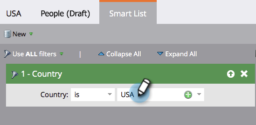

# Définir des règles de segmentation {#define-segment-rules}

La définition de règles de segment permet de classer les utilisateurs en différents groupes s’excluant mutuellement.

>[!PREREQUISITES]
>
>[Créer une segmentation](/help/marketo/product-docs/personalization/segmentation-and-snippets/segmentation/create-a-segmentation.md)

1. Accédez à la **[!UICONTROL Base de données]**.

   

1. Sélectionnez **[!UICONTROL Segmentations]** dans l’arborescence, puis cliquez sur un **Segment** particulier.

   

1. Cliquez sur **[!UICONTROL Liste dynamique]** et ajoutez des filtres.

   

   >[!CAUTION]
   >
   >Les segments ne prennent actuellement pas en charge les opérateurs _Dans le passé_ et _Dans la période_ sur les filtres. En effet, les segmentations ne vérifient les mises à jour que lorsqu’une valeur de données de modification est consignée. Ces valeurs ne sont _pas_ consignées pour les éléments qui changent automatiquement, tels que les champs de formule et les dates. En outre, les opérateurs de date avec des périodes relatives ne sont pas pris en charge, car ils sont calculés au moment de la validation de la segmentation, et non au moment d’une activité Modifier la valeur des données .

   >[!NOTE]
   >
   >Les filtres « Type de SFDC » et « Type de Microsoft » ne sont actuellement pas pris en charge dans les listes dynamiques de segmentation.

1. Renseignez les valeurs appropriées pour les filtres.

   

   >[!CAUTION]
   >
   >Le comportement de journalisation des activités pour les champs Compte peut avoir un impact sur la qualification. Par conséquent, nous déconseillons l’utilisation des champs Compte lors de la définition de règles de segment.

1. Cliquez sur l’onglet **[!UICONTROL Personnes (brouillon)]** pour afficher les personnes qui peuvent être membres de ce segment.

   

1. Accédez à **[!UICONTROL Actions de segmentation]**. Cliquez sur **[!UICONTROL Approuver]**.

   

   >[!CAUTION]
   >
   >Le nombre total de segments que vous pouvez créer dans une segmentation dépend du nombre et du type de filtres utilisés, ainsi que de la complexité de la logique de vos segments. Bien que vous puissiez créer jusqu’à 100 segments à l’aide de champs standard, l’utilisation d’autres types de filtres peut augmenter la complexité et votre segmentation peut échouer à approuver. Voici quelques exemples : champs personnalisés, membre de la liste, champs du propriétaire du prospect et étapes de chiffre d’affaires.
   >
   >Si un message d’erreur s’affiche lors de la validation et que vous avez besoin d’aide pour réduire la complexité de votre segmentation, contactez l’assistance de [Marketo](https://nation.marketo.com/t5/Support/ct-p/Support).

1. Consultez le tableau de bord pour obtenir un aperçu rapide de vos segments dans un graphique en secteurs, ainsi que des règles appliquées.

   

Bon travail ! Ces segments seront utiles dans de nombreux endroits de Marketo.

>[!NOTE]
>
>Une personne peut être éligible à différents segments, mais appartient finalement à un seul segment, en fonction de l’ordre de priorité [&#x200B; des segments](/help/marketo/product-docs/personalization/segmentation-and-snippets/segmentation/segmentation-order-priority.md).

>[!NOTE]
>
>L’écran [!UICONTROL Personnes (brouillon)] affiche toutes les personnes qui remplissent les critères pour être membre et n’est pas toujours la liste finale des personnes. Approuvez votre segment pour afficher la liste finale.

>[!MORELIKETHIS]
>
>[Approuver une segmentation](/help/marketo/product-docs/personalization/segmentation-and-snippets/segmentation/approve-a-segmentation.md)
