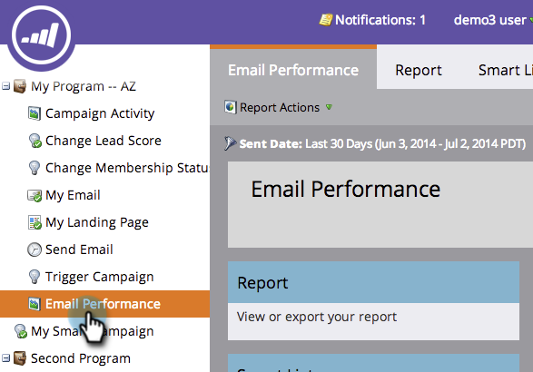
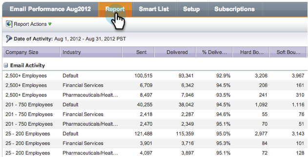

# Regrouper les rapports par courriel par segment {#group-email-reports-by-segmentations}

Les segments ne sont pas uniquement destinés au contenu dynamique. Vous pouvez également regrouper votre rapport [de performances des](../../../../product-docs/email-marketing/email-programs/email-program-data/email-performance-report.md) courriels par [segmentation](http://docs.marketo.com/display/docs/segmentation+and+snippets).

>[!NOTE]
>
>**Conditions préalables**
>
>* [Approbation d’une segmentation](approve-a-segmentation.md)

>

1. Accédez à la zone Activités **** marketing (ou **Analytics**).

   

1. Sélectionnez votre rapport Performances **des** courriels.

   

1. Cliquez sur l’onglet **Configuration** et faites glisser le pointeur de la souris sur **Regrouper par segment**.

   

1. Choisissez une ou deux segments à utiliser pour regrouper votre rapport. Cliquez sur **APPLIQUER**.

   

1. C&#39;est tout ! Cliquez sur l’onglet **Rapport** . Si vous utilisez une segmentation, votre rapport affiche une ligne pour chaque segment.

   

1. Si vous utilisez deux segments, il affiche une ligne pour chaque *combinaison* de segments.

   

>[!NOTE]
>
>**Articles connexes**
>
>* [Filtrage des ressources dans un rapport par courriel](../../../../product-docs/reporting/basic-reporting/report-activity/filter-assets-in-an-email-report.md)

>

