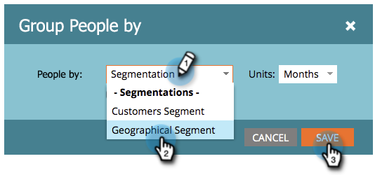

# Rapports de personnes de groupe par segment {#group-person-reports-by-segment}

Vous pouvez regrouper vos rapports de personne selon n’importe quel segment que vous avez défini dans vos segments.

1. Accédez à **Activités marketing** (ou **Analytics**).

   

1. Sélectionnez le rapport de votre personne dans l’arborescence de navigation.

   

1. Cliquez sur le bouton **Configuration** et double-cliquez **Regrouper les personnes par**.

   

   >[!NOTE]
   >
   >Vous pouvez également [regrouper vos rapports de personne par personne ou par attribut de société ;](/help/marketo/product-docs/reporting/basic-reporting/report-activity/group-person-reports-by-attribute.md).

1. Dans le **Regrouper les personnes par** , commencez à saisir &quot;Segmentation&quot; dans la zone de texte. Lorsque la variable **Segments** s’affiche, sélectionnez-en un dans la liste située sous l’en-tête .

   

1. Cliquez sur le bouton **Rapport** pour voir votre rapport regroupé par segment sélectionné.

   

>[!MORELIKETHIS]
>
>[Ajout de colonnes personnalisées à un rapport Personne](/help/marketo/product-docs/reporting/basic-reporting/editing-reports/add-custom-columns-to-a-person-report.md)
