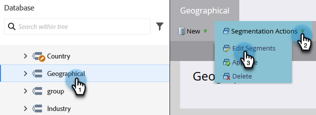

# Ordre de priorité des segmentations {#segmentation-order-priority}

Il est important de comprendre comment **ordre** définit la priorité de l’évaluation de vos personnes dans une segmentation.

>[!PREREQUISITES]
>
>[Créer une segmentation](/help/marketo/product-docs/personalization/segmentation-and-snippets/segmentation/create-a-segmentation.md)
>[Définissez Des Règles De Segment](/help/marketo/product-docs/personalization/segmentation-and-snippets/segmentation/define-segment-rules.md)

>[!NOTE]
>
>Vous pouvez uniquement modifier une segmentation en mode brouillon.

1. Accédez à la **Base de données**.

   

1. Sélectionnez votre **Segmentation**. Dans **[!UICONTROL Actions de segmentation]**, cliquez sur **[!UICONTROL Modifier les segments]**.

   

   Vous pouvez vérifier ou modifier l’ordre de vos segments à partir de cet écran.

   

>[!NOTE]
>
>* Les segments s’excluent mutuellement. Une personne ne peut être membre que d’un seul segment à la fois.
>* Lorsqu’une personne est admissible pour deux segments, elle n’appartiendra qu’au premier de la liste.
>* Si une personne n’est éligible à aucun segment, elle deviendra membre du segment par défaut.
