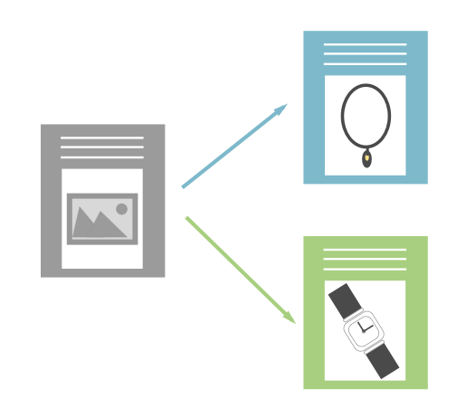

# Présentation du contenu dynamique {#understanding-dynamic-content}

La personnalisation ne se limite pas à un simple « Bonjour `{{First_Name}}` ». Avec le contenu dynamique de Marketo, vous pouvez personnaliser la manière dont différentes personnes voient une page de destination ou un e-mail.

## Segmentation {#segmentation}

Tout d&#39;abord, vous devrez diviser vos employés en sous-groupes. Cela s’appelle [segmentation](/help/marketo/product-docs/personalization/segmentation-and-snippets/segmentation/create-a-segmentation.md).

>[!NOTE]
>
>**Définition**
>
>La segmentation classe votre audience en différents sous-groupes en fonction d’une règle [ Liste dynamique ](/help/marketo/product-docs/core-marketo-concepts/smart-campaigns/understanding-smart-campaigns.md). Ces groupes sont appelés segments.

Par exemple, si nous avons une segmentation appelée Industrie, certains des segments pourraient être : Santé, Technologie, Financier, Biens de consommation, etc.

## Contenu dynamique {#dynamic-content}

Une fois que vous avez créé différents segments, vous pouvez ajouter des blocs de contenu dynamique dans votre page de destination ou votre e-mail. Cela indique à Marketo que vous souhaitez que cet élément de contenu soit différent en fonction de la personne qui l’affiche.

## Extraits {#snippets}

Les [fragments de code](/help/marketo/product-docs/personalization/segmentation-and-snippets/snippets/create-a-snippet.md) sont un outil utile dans Marketo. Créez-le une fois et utilisez-le à plusieurs endroits ! Si vous mettez à jour le fragment de code, toutes les ressources (pages de destination ou e-mails) qui l’utilisent sont automatiquement mises à jour.

>[!NOTE]
>
>**Exemple**
>
>* Vous pouvez utiliser un fragment de code comme signature dans un e-mail. Modifiez le texte de manière dynamique en fonction de l’emplacement du destinataire.
>* Sur les pages de destination, disposez d’une zone call-to-action standard avec des liens différents pour les clients et les prospects. Mettez à jour des centaines d’adresses IP de manière centralisée.

Faites un essai et racontez-nous votre histoire de réussite !

>[!MORELIKETHIS]
>
>* [Créer une segmentation](/help/marketo/product-docs/personalization/segmentation-and-snippets/segmentation/create-a-segmentation.md)
>* [Créer un fragment de code](/help/marketo/product-docs/personalization/segmentation-and-snippets/snippets/create-a-snippet.md)
