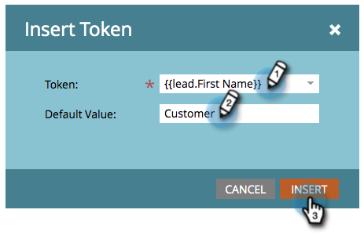

# Ajouter du contenu à un extrait de code {#add-content-to-a-snippet}

>[!PREREQUISITES]
>
>[Création d’un extrait de code](create-a-snippet.md)

Vous pouvez ajouter des jetons, des images, des fichiers ou du texte enrichi à un extrait de code.

>[!NOTE]
>
>Vous ne pouvez pas incorporer de syntaxe [de courriel](/help/marketo/product-docs/email-marketing/general/email-editor-2/email-template-syntax.md) Marketo dans des extraits de code ; cela **ne fonctionnera pas** dans un courriel. Les extraits de code doivent être simplement du contenu du corps (HTML + TEXTE).

1. Rendez-vous au **Design Studio.**

   

1. Sélectionnez votre **extrait de code** , puis cliquez sur **Modifier le brouillon**.

   

Vous pouvez ajouter trois types de contenu à un extrait de code.

## Jeton d&#39;Ajoute {#add-token}

1. Faites glisser et déposez l’élément **Jeton** .

   

1. Saisissez **Token** et cliquez sur **Insérer**.

   

## Ajouter l&#39;image/le fichier {#add-image-file}

1. Faites glisser et déposez l’élément **Image/Fichier** .

   

   >[!NOTE]
   >
   >Vous pouvez ajouter vos propres images ou fichiers à Marketing Cloud. En savoir plus sur [les images et les fichiers](http://docs.marketo.com/display/docs/images+and+files).

1. Sélectionnez l’ **image** à utiliser, puis cliquez sur **Insérer**.

   

   >[!NOTE]
   >
   >Vous pouvez également rechercher une image spécifique si vous connaissez son nom.

## Ajouter du texte {#add-text}

1. Saisissez le texte dans la zone Version HTML.

   

   >[!TIP]
   >
   >Utilisez les outils de formatage pour personnaliser votre texte.

1. Pour les courriers électroniques, cliquez sur l’onglet Version **du** texte.

   

1. Cliquez sur **Copier à partir du code HTML**.

   

   >[!NOTE]
   >
   >Les images, liens et mises en forme sont supprimés dans la version de texte.

Cool ! Vous pouvez désormais créer divers contenus pour votre extrait de code.

>[!MORELIKETHIS]
>
>* [Prévisualisation d’un extrait de code](preview-a-snippet.md)
>* [Approbation d’un extrait de code](approve-a-snippet.md)

