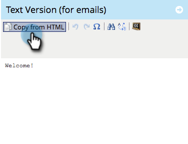

# Ajouter du contenu à un fragment de code {#add-content-to-a-snippet}

>[!PREREQUISITES]
>
>[Créer un fragment de code](/help/marketo/product-docs/personalization/segmentation-and-snippets/snippets/create-a-snippet.md)

Vous pouvez ajouter des jetons, des images, des fichiers ou du texte enrichi à un fragment de code.

>[!NOTE]
>
>Vous ne pouvez pas incorporer de syntaxe d&#39;e-mail [Marketo](/help/marketo/product-docs/email-marketing/general/email-editor-2/email-template-syntax.md) dans des fragments de code ; elle **ne fonctionnera pas** dans un e-mail. Les fragments de code doivent simplement être du contenu (HTML + TEXTE).

1. Accédez au **[!UICONTROL Design Studio]**.

   

1. Sélectionnez votre **Extrait de code** puis cliquez sur **[!UICONTROL Modifier le brouillon]**.

   

Vous pouvez ajouter trois types de contenu à un fragment de code.

## Ajouter [!UICONTROL Jeton] {#add-token}

1. Effectuez un glisser-déposer de l’élément **[!UICONTROL Token]**.

   

1. Saisissez **[!UICONTROL Jeton]**, puis cliquez sur **[!UICONTROL Insérer]**.

   

## Ajouter une image/un fichier {#add-image-file}

1. Effectuez un glisser-déposer de l’élément **[!UICONTROL Image/Fichier]**.

   

   >[!NOTE]
   >
   >Vous pouvez ajouter vos propres images ou fichiers à Marketo. En savoir plus sur les [images et fichiers](/help/marketo/product-docs/demand-generation/images-and-files/add-images-and-files-to-marketo.md).

1. Sélectionnez l’**Image** à utiliser, puis cliquez sur **[!UICONTROL Insérer]**.

   

   >[!NOTE]
   >
   >Vous pouvez également rechercher une image spécifique si vous connaissez son nom.

## Ajouter un texte {#add-text}

1. Saisissez dans la zone Version d’HTML pour ajouter du texte.

   

   >[!TIP]
   >
   >Utilisez les outils de mise en forme pour personnaliser votre texte.

1. Pour E-mails, cliquez sur l’onglet **[!UICONTROL Version texte (pour les e-mails)]** .

   

1. Cliquez sur **[!UICONTROL Copier depuis HTML]**.

   

   >[!NOTE]
   >
   >Les images, les liens et la mise en forme sont supprimés dans la version texte.

Cool ! Vous pouvez maintenant créer du contenu varié pour votre fragment de code.

>[!MORELIKETHIS]
>
>* [Prévisualiser un fragment de code](/help/marketo/product-docs/personalization/segmentation-and-snippets/snippets/preview-a-snippet.md)
>* [Approuver un fragment de code](/help/marketo/product-docs/personalization/segmentation-and-snippets/snippets/approve-a-snippet.md)
