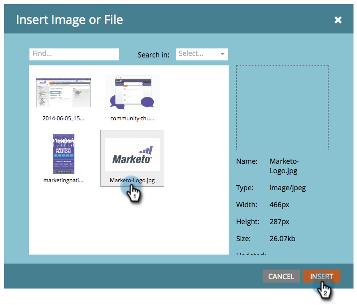

# Ajout de contenu à un fragment de code {#add-content-to-a-snippet}

>[!PREREQUISITES]
>
>[Créer un fragment de code](/help/marketo/product-docs/personalization/segmentation-and-snippets/snippets/create-a-snippet.md)

Vous pouvez ajouter des jetons, des images, des fichiers ou du texte enrichi à un fragment de code.

>[!NOTE]
>
>Vous ne pouvez pas incorporer de [syntaxe d’email Marketo](/help/marketo/product-docs/email-marketing/general/email-editor-2/email-template-syntax.md) dans des fragments de code ; il **ne fonctionnera pas** dans un email. Les fragments de code doivent être simplement du contenu du corps (HTML + TEXTE).

1. Accédez à **Design Studio**.

   

1. Sélectionnez votre **extrait de code** et cliquez sur **Modifier le brouillon**.

   

Vous pouvez ajouter trois types de contenu à un fragment de code.

## Ajouter un jeton {#add-token}

1. Faites glisser et déposez l’élément **Token** .

   

1. Saisissez **Jeton** et cliquez sur **Insérer**.

   

## Ajouter une image/un fichier {#add-image-file}

1. Faites glisser et déposez l’élément **Image/File** .

   

   >[!NOTE]
   >
   >Vous pouvez ajouter vos propres images ou fichiers à Marketo. En savoir plus sur [images et fichiers](/help/marketo/product-docs/demand-generation/images-and-files/add-images-and-files-to-marketo.md).

1. Sélectionnez l&#39;**Image** à utiliser et cliquez sur **Insérer**.

   

   >[!NOTE]
   >
   >Vous pouvez également rechercher une image spécifique si vous connaissez son nom.

## Ajouter un texte {#add-text}

1. Saisissez dans la zone HTML version pour ajouter du texte.

   

   >[!TIP]
   >
   >Utilisez les outils de formatage pour personnaliser votre texte.

1. Pour les emails, cliquez sur l’onglet **Version de texte** .

   

1. Cliquez sur **Copier depuis l’HTML**.

   

   >[!NOTE]
   >
   >Les images, les liens et la mise en forme sont supprimés dans la version de texte.

Super ! Vous pouvez désormais créer un large éventail de contenu pour votre extrait de code.

>[!MORELIKETHIS]
>
>* [Aperçu d’un fragment de code](/help/marketo/product-docs/personalization/segmentation-and-snippets/snippets/preview-a-snippet.md)
>* [Approuver un fragment de code](/help/marketo/product-docs/personalization/segmentation-and-snippets/snippets/approve-a-snippet.md)
