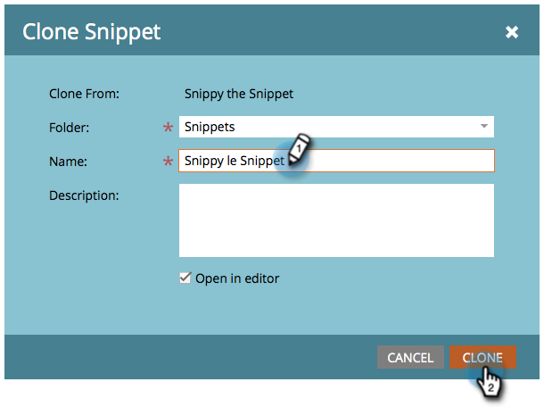

# Cloner un extrait {#clone-a-snippet}

Clonez un fragment de code afin d’en créer une copie que vous pouvez modifier selon vos besoins.

1. Accédez au **[!UICONTROL Design Studio]**.

   

1. Accédez à votre fragment de code, puis sous **[!UICONTROL Actions liées au fragment de code]**, cliquez sur **[!UICONTROL Cloner]**.

   

1. Saisissez les détails du fragment de code, puis cliquez sur **[!UICONTROL Cloner]**.

   

Génial ! Vous pouvez maintenant modifier le fragment de code cloné en fonction de vos besoins.

>[!MORELIKETHIS]
>
>[Modifier des fragments de code avec du contenu dynamique](/help/marketo/product-docs/personalization/segmentation-and-snippets/snippets/edit-snippets-with-dynamic-content.md)
