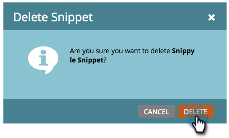

# Suppression d’un extrait de code {#delete-a-snippet}

>[!PREREQUISITES]
>
>* [Désapprouver un extrait de code](unapprove-a-snippet.md)

>

Supprimez un fragment dont vous n&#39;avez plus besoin.

1. Rendez-vous au **Design Studio.**

   

1. Accédez à votre extrait de code, puis sous Actions **de** fragment de code, cliquez sur **Supprimer**.

   

1. Cliquez sur **Supprimer **pour confirmer ou simplement **Annuler**.

   

   >[!NOTE]
   >
   >**Rappel**
   >
   >
   >Vous pouvez uniquement supprimer un fragment de code non approuvé et non utilisé par des ressources.

Fait ! Vous ne pouvez pas le récupérer. Veillez donc à cliquer sur le bouton Supprimer avant de le récupérer.
