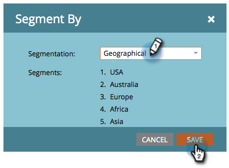

# Modifier des extraits avec du contenu dynamique {#edit-snippets-with-dynamic-content}

>[!PREREQUISITES]
>
>* [Créer une segmentation](/help/marketo/product-docs/personalization/segmentation-and-snippets/segmentation/create-a-segmentation.md)
>* [Créer un fragment de code](/help/marketo/product-docs/personalization/segmentation-and-snippets/snippets/create-a-snippet.md)

Utilisez la segmentation dans les fragments de code pour gérer facilement le contenu dynamique sur vos e-mails et landing pages.

## Ajouter une segmentation {#add-segmentation}

1. Accédez au **[!UICONTROL Design Studio]**.

   

1. Cliquez sur votre **Extrait de code** puis sur **[!UICONTROL Modifier le brouillon]**.

   

1. Cliquez sur **[!UICONTROL Segmenter par]**.

   

1. Saisissez **[!UICONTROL Segmentation]** et cliquez sur **[!UICONTROL Enregistrer]**.

   

## Application de contenu dynamique {#apply-dynamic-content}

1. Cliquez sur un **Segment** puis modifiez le contenu. Répéter pour chaque segment

   

>[!NOTE]
>
>N’oubliez pas d’approuver le fragment de code avant de l’utiliser.

N&#39;était-ce pas simple ? Vous êtes maintenant prêt à utiliser ces fragments de code dans les e-mails et les landing pages.

>[!MORELIKETHIS]
>
>* [Ajouter un fragment de code à un e-mail](/help/marketo/product-docs/email-marketing/general/functions-in-the-editor/add-a-snippet-to-an-email.md)
>* [Ajouter un fragment de code à une page de destination](/help/marketo/product-docs/demand-generation/landing-pages/personalizing-landing-pages/add-a-snippet-to-a-landing-page.md)
