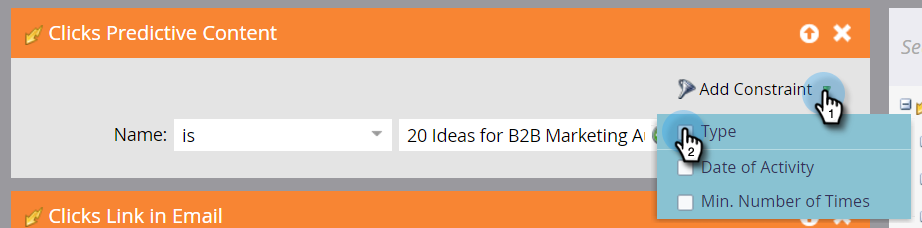

# Définir une Liste intelligente pour les Activités de contenu prédictif {#define-a-smart-list-for-predictive-content-activities}

>[!NOTE]
>
>Selon la date d’achat, votre abonnement Marketo peut inclure soit du contenu prédictif ou du contenu `AI`. Pour les utilisateurs de contenu prédictif, Marketo active les fonctionnalités Content`AI` Analytics jusqu’au 30 avril 2018. Pour conserver ces fonctionnalités au-delà de cette date, contactez votre responsable de succès client Marketo pour effectuer la mise à niveau vers Marketo Content`AI`.

Vous pouvez utiliser des activités de contenu prédictif dans les déclencheurs et les filtres lorsque vous définissez une liste intelligente dans une campagne dynamique. Vous pouvez déclencher une action pour toute personne qui clique sur du contenu prédictif via le [modèle de média enrichi](enabling-predictive-content/enable-predictive-content-for-web-rich-media.md), la [barre de recommandation du contenu](enabling-predictive-content/enable-the-content-recommendation-bar.md) ou dans un courrier électronique.

1. Dans votre campagne intelligente, accédez à l&#39;onglet **Liste intelligente**.

   

   >[!NOTE]
   >
   >**Plongée profonde**
   >
   >
   >Les listes intelligentes peuvent faire des choses incroyables. Pour en savoir plus sur la plongée en [liste intelligente](../../product-docs/core-marketo-concepts/smart-campaigns/understanding-smart-campaigns.md).

1. Recherchez le déclencheur, puis faites-le glisser sur la trame.

   

   >[!NOTE]
   >
   >Une campagne intelligente avec des déclencheurs s’exécute en mode Déclencheur. Il s’exécute sur une personne à la fois en fonction des événements déclenchés et des filtres ajoutés.

1. Cliquez sur la liste déroulante **Nom** et sélectionnez un opérateur.

   

1. Définissez le déclencheur.

   

1. Ajoutez la contrainte **Type**.

   

1. Sélectionnez la source dont vous avez besoin pour votre liste intelligente.

   

1. Si vous utilisez la source de courriel pour votre contenu prédictif, ajoutez le **lien Clics dans le déclencheur **trigger. Sélectionnez votre adresse électronique et ajoutez la contrainte **Is Predictive**, définie comme **true**.

   

1. Ajoutez les autres filtres si nécessaire.

   

   >[!TIP]
   >
   >Dans une campagne intelligente avec des déclencheurs et des filtres, les déclencheurs sont placés en haut. Lorsqu’elle est déclenchée, seules les personnes qui satisfont aux critères de filtre parcourent le flux.

   >[!NOTE]
   >
   >Avec plusieurs déclencheurs, une personne passe au flux si l’un des déclencheurs est activé.

   [définir une liste intelligente pour une campagne par lot](../../product-docs/core-marketo-concepts/smart-campaigns/creating-a-smart-campaign/define-smart-list-for-smart-campaign-batch.md)

   >[!MORELIKETHIS]
   >
   >
   >    
   >    
   >    * [Définir une Liste intelligente pour une Campaign intelligente | Lot](../../product-docs/core-marketo-concepts/smart-campaigns/creating-a-smart-campaign/define-smart-list-for-smart-campaign-batch.md)
   >    * [Ajouter une étape de flux à un Campaign dynamique](../../product-docs/core-marketo-concepts/smart-campaigns/flow-actions/add-a-flow-step-to-a-smart-campaign.md)
   >    * [Définir une Liste intelligente pour les Activités de personnalisation Web](../../product-docs/web-personalization/working-with-web-campaigns/define-a-smart-list-for-web-personalization-activities.md)
   >    * [Activer le contenu prédictif pour les médias enrichis en ligne](enabling-predictive-content/enable-predictive-content-for-web-rich-media.md)
   >    * [Activation de la barre de recommandation de contenu](enabling-predictive-content/enable-the-content-recommendation-bar.md)

Pour exécuter la campagne sur un ensemble de personnes en même temps, apprenez à .