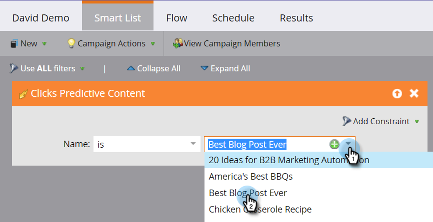

# Définir une liste intelligente pour les activités de contenu prédictif {#define-a-smart-list-for-predictive-content-activities}

Vous pouvez utiliser des activités de contenu prédictives dans des déclencheurs et des filtres lorsque vous définissez une liste dynamique dans une campagne dynamique. Vous pouvez déclencher une action pour toute personne qui clique sur du contenu prédictif via le [modèle de contenu multimédia enrichi](/help/marketo/product-docs/predictive-content/enabling-predictive-content/enable-predictive-content-for-web-rich-media.md), la [barre de recommandation de contenu](/help/marketo/product-docs/predictive-content/enabling-predictive-content/enable-the-content-recommendation-bar.md) ou dans un [e-mail](/help/marketo/product-docs/predictive-content/enabling-predictive-content/enable-predictive-content-in-emails.md).

1. Dans votre campagne dynamique, accédez à l’onglet **[!UICONTROL Liste dynamique]**.

   

   >[!NOTE]
   >
   >Les listes dynamiques peuvent faire des choses incroyables. Pour en savoir plus, consultez la [exploration en profondeur des listes intelligentes](/help/marketo/product-docs/core-marketo-concepts/smart-campaigns/understanding-smart-campaigns.md).

1. Recherchez le déclencheur, puis faites-le glisser et déposez-le sur la zone de travail.

   

   >[!NOTE]
   >
   >Une campagne intelligente avec des déclencheurs s’exécute en mode Déclencheur . Il s’exécute sur une personne à la fois en fonction des événements déclenchés et des filtres ajoutés.

1. Cliquez sur le menu déroulant **[!UICONTROL Nom]** et sélectionnez un opérateur.

   

1. Définissez le déclencheur.

   

1. Ajoutez la contrainte **[!UICONTROL Type]**.

   

1. Sélectionnez la source dont vous avez besoin pour votre liste dynamique.

   

1. Si vous utilisez la source d’e-mail pour votre contenu prédictif, ajoutez le déclencheur **[!UICONTROL Lien des clics dans l’e-mail]**. Sélectionnez votre e-mail et ajoutez la contrainte **[!UICONTROL Est prédictif]**, définie sur **[!UICONTROL true]**.

   

1. Ajoutez d’autres filtres si nécessaire.

   

   >[!TIP]
   >
   >Dans une campagne intelligente avec des déclencheurs et des filtres, les déclencheurs se trouvent en haut. Lorsqu’il est déclenché, seules les personnes qui répondent aux critères de filtrage passent par le flux.

   >[!NOTE]
   >
   >Avec plusieurs déclencheurs, une personne accède au flux si L’UN DES déclencheurs est activé.

   Pour exécuter la campagne sur un ensemble de personnes simultanément, découvrez comment [définir une liste dynamique pour une campagne dynamique par lots](/help/marketo/product-docs/core-marketo-concepts/smart-campaigns/creating-a-smart-campaign/define-smart-list-for-smart-campaign-batch.md).

   >[!MORELIKETHIS]
   >
   >* [Définir une liste dynamique pour une campagne dynamique | Lot &#x200B;](/help/marketo/product-docs/core-marketo-concepts/smart-campaigns/creating-a-smart-campaign/define-smart-list-for-smart-campaign-batch.md)
   >* [Ajouter une étape de flux à une campagne dynamique](/help/marketo/product-docs/core-marketo-concepts/smart-campaigns/flow-actions/add-a-flow-step-to-a-smart-campaign.md)
   >* [Définition d’une liste dynamique pour les activités Web Personalization](/help/marketo/product-docs/web-personalization/working-with-web-campaigns/define-a-smart-list-for-web-personalization-activities.md)
   >* [Activer le contenu prédictif pour les médias riches en contenu web](/help/marketo/product-docs/predictive-content/enabling-predictive-content/enable-predictive-content-for-web-rich-media.md)
   >* [Activer la barre de recommandations de contenu](/help/marketo/product-docs/predictive-content/enabling-predictive-content/enable-the-content-recommendation-bar.md)
