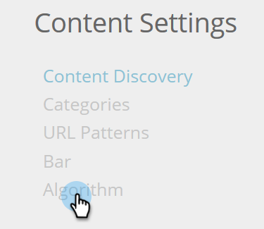

# Paramètres de l&#39;objectif de l&#39;algorithme {#algorithm-goal-settings}

Les paramètres d’objectif de l’algorithme vous permettent de définir l’objectif final de l’algorithme d’intelligence artificielle de contenu prédictif pour l’aligner sur vos objectifs commerciaux.

1. Dans Contenu prédictif, cliquez sur le nom de votre connexion et sélectionnez **Paramètres de contenu**.

   

1. Sous Paramètres de contenu, sélectionnez **Algorithme**.

   

1. Sélectionnez un objectif pour chaque source de contenu prédictif pour l’algorithme IA afin d’optimiser les performances de votre contenu.

   

   | **`Clicks`** | Affichez le contenu le plus susceptible de faire cliquer sur celui-ci |
   |---|---|
   | **`Conversions`** | Afficher le contenu de manière à ce que la personne qui consulte le contenu envoie un formulaire |

1. Cliquez sur **Enregistrer** lorsque vous avez terminé.

   

