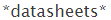

# Créer des modèles de contenu {#create-content-patterns}

>[!NOTE]
>
>Selon la date d’achat, votre abonnement Marketo peut inclure soit du contenu prédictif ou du contenu `AI`. Pour les utilisateurs de contenu prédictif, Marketo active les fonctionnalités Content`AI` Analytics jusqu’au 30 avril 2018. Pour conserver ces fonctionnalités au-delà de cette date, contactez votre responsable de succès client Marketo pour effectuer la mise à niveau vers Marketo Content`AI`.

Lorsque vous définissez des modèles de contenu, le contenu est automatiquement découvert lorsqu’un visiteur Web clique sur la page Web HTML correspondant au modèle de contenu. Il est utilisé pour ajouter des pages HTML (billets de blog, communiqués de presse, articles d&#39;actualité) en tant que parties de contenu à la page Tout le contenu. Lorsque la détection automatique est basée sur des modèles de contenu, elle détecte et suit les pages HTML liées au modèle d’URL défini lorsqu’un visiteur Web vue ou clique sur un lien vers la page. Cet élément de contenu (URL, nom de page et métadonnées, y compris l’URL de l’image et la description) est ajouté à la page Tout le contenu pour préparer le contenu prédictif. Pour découvrir automatiquement d’autres contenus, tels que des fichiers PDF et des vidéos incorporées, vous devez [activer la détection de contenu](enable-content-discovery.md).

1. Accédez à **Paramètres de contenu**.

   

1. Cliquez sur **Modèles d’URL**.

   

1. Cliquez sur **+ **pour ouvrir une ligne où vous pouvez saisir vos informations.

   

1. Ajoutez l’extension d’URL du domaine où se trouve la page Web. Sélectionnez la catégorie (par exemple, Blog, Article, Fiche produit, Communiqué de presse).

   

   >[!NOTE]
   >
   >Les éléments de la liste déroulante sur la droite reflètent les catégories que vous avez configurées lorsque vous avez [créé des catégories](set-up-categories.md).

1. Cliquez sur **+ **pour ajouter un autre chemin.

   

1. Ajoutez l’extension et la catégorie du chemin d’accès supplémentaire et cliquez sur **Enregistrer**.

   

## Règles de modèle de contenu {#content-pattern-rules}

* Vous pouvez utiliser un caractère générique n’importe où dans une expression (exemple : *domain.com/**, *domain.com/*blog**)

* Nous recommandons d’utiliser /* à la fin d’une expression pour continuer la découverte de modèles (Exemple : *domain.com/blog/** détecte toutes les publications du dossier Blog)
* Les modèles de contenu ne respectent pas la casse (exemple : *domain.com/Blog/** détecte toutes les pages html sur *domain.com/Blog* et *domain.com/blog*)

* Les paramètres d’URL ne sont pas détectés (ce qui évite de découvrir plusieurs éléments avec la même URL de contenu mais des paramètres différents).

## Exemples {#examples}

Pour *domain.com* :

<table> 
 <tbody> 
  <tr> 
   <th>Modèle d’URL</th> 
   <th>Résultat</th> 
  </tr> 
  <tr> 
   <td>blog/*</td> 
   <td>
Découvre tout le contenu correspondant au modèle domain.com/blog/ :

domain.com/blog/5-top-tricks

domain.com/blog/2017/new-year-solutions

domain.com/Blog/3-best-recipes
</td> 
  </tr> 
  <tr> 
   <td>article/2017/*</td> 
   <td>
Découvre tout le contenu correspondant au modèle domain.com/article/2017/ :

domain.com/article/2017/5-top-tricks
</td> 
  </tr> 
  <tr> 
   <td></td> 
   <td>
Découvre toute URL contenant le mot "feuille de données :".

domain.com/datasheets/5-top-tricks

domain.com/blog/5-top-datasheets
</td> 
  </tr> 
  <tr> 
   <td>communiqué de presse</td> 
   <td>
Une seule page HTML à correspondance exacte est découverte :

domain.com/press-release
</td> 
  </tr> 
  <tr> 
   <td colspan="1"> </td> 
   <td colspan="1">
Si l’expression d’URL est vide, le modèle d’URL détecte uniquement la page d'accueil :

domain.com
</td> 
  </tr> 
 </tbody> 
</table>

