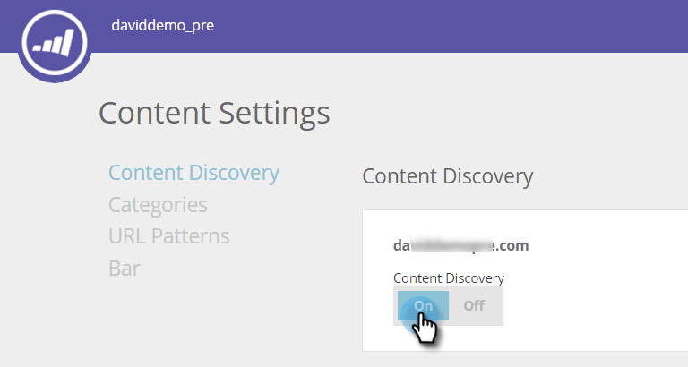

# Activation de la détection de contenu {#enable-content-discovery}

La fonctionnalité Découverte de contenu détecte et balise automatiquement votre contenu existant (y compris les études de cas, les publications de blog, les vidéos, les communiqués de presse, etc.). de votre site web et effectue le suivi du nombre de consultations sur ces documents.  Le contenu prédictif utilise le contenu découvert en utilisant des analyses prédictives pour déterminer quel est votre contenu le plus performant et recommande le meilleur contenu à la bonne personne.

1. Accédez à **Paramètres de contenu**.

   

1. Remplacez la détection de contenu par **On**.

   

La définition de la détection de contenu sur Activé permet de découvrir automatiquement un contenu PDF ou vidéo lorsqu’un visiteur web clique sur le fichier ou regarde la vidéo. Cet élément de contenu (URL, nom du contenu et URL de l’image) est ajouté, puis suivi sous la page Tout le contenu . Lors de la découverte automatique d’une vidéo, nous découvrons une vidéo lorsqu’un visiteur web clique et regarde une vidéo incorporée depuis YouTube, Vimeo ou Wistia. Pour découvrir automatiquement d’autres contenus, vous devez [créer des modèles de contenu](/help/marketo/product-docs/predictive-content/getting-started/create-content-patterns.md).
