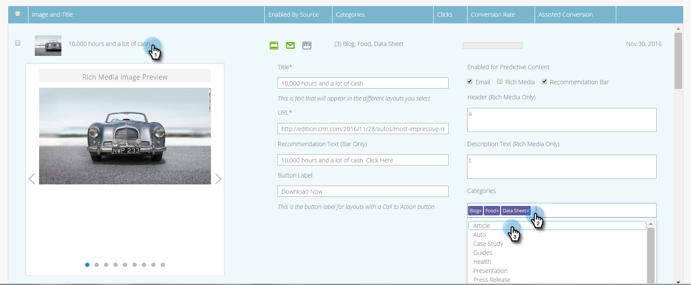

# Configuration des catégories {#set-up-categories}

Créez des catégories dans Contenu prédictif pour regrouper vos résultats prédictifs sur le web ou par e-mail. Par exemple, vous ne pouvez travailler qu’avec des blogs ou du contenu dans une langue particulière. Il vous permet également de rechercher et de filtrer votre page vue.  Les catégories sont affichées dans les pages Contenu complet et Contenu prédictif pour une référence facile.

Lorsque vous modifiez du contenu découvert, ajoutez des catégories dans l’écran de modification. Cliquez sur le champ **Catégories** et sélectionnez-les dans la liste déroulante.

Lorsque vous ajoutez du contenu, vous pouvez le baliser avec les catégories sélectionnées dans la fenêtre contextuelle.

## Création de balises de catégorie {#create-category-tags}

Voici comment créer des balises de catégorie.

1. Accédez à **Paramètres de contenu**.

   

1. Cliquez sur **Catégories**.

   

1. Les balises de catégorie existantes s’affichent. Saisissez une nouvelle balise de catégorie et cliquez sur **Créer**.

   

1. Vous pouvez supprimer une balise de catégorie en cliquant sur le **x** en regard de celle-ci.

   

1. Cliquez sur **Enregistrer** lorsque vous avez terminé.

   

   Assez simple.
