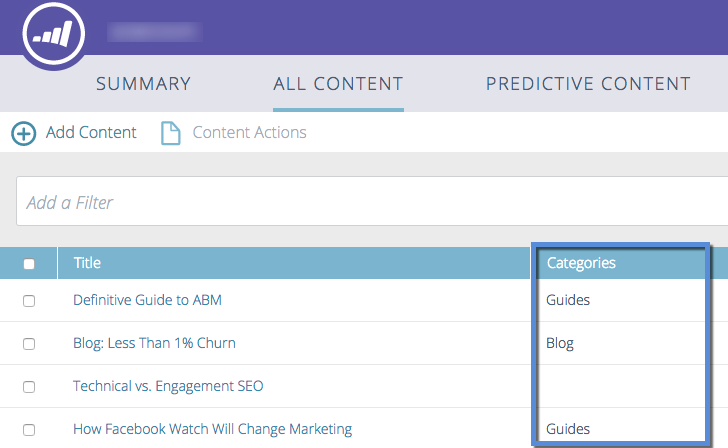

# Configurer des Catégories {#set-up-categories}

>[!NOTE]
>
>Selon la date d’achat, votre abonnement Marketo peut inclure du contenu prédictif ou du contenu`AI`. Pour les utilisateurs de contenu prédictif, Marketo active les fonctionnalités d’analyse de contenu`AI` jusqu’au 30 avril 2018. Pour conserver ces fonctionnalités au-delà de cette date, contactez votre responsable de succès client Marketing Cloud pour effectuer la mise à niveau vers le contenu`AI`Marketo.

Créez des catégories dans Contenu prédictif pour regrouper vos résultats prédictifs sur le Web ou par courriel. Par exemple, vous pouvez travailler uniquement avec des blogs ou avec du contenu dans une langue particulière. Il vous permet également de rechercher et de filtrer la vue de vos pages.  Les catégories s’affichent dans les pages Tout le contenu et Contenu prédictif pour faciliter les références.

Lorsque vous modifiez du contenu découvert, ajoutez des catégories dans l’écran de modification. Cliquez sur le champ **Catégories** et sélectionnez-les dans la liste déroulante.

Lorsque vous ajoutez du contenu, vous pouvez le marquer avec des catégories sélectionnées dans la fenêtre contextuelle.

## Création de balises de Catégorie {#create-category-tags}

Voici comment créer des balises de catégorie.

1. Accédez à Paramètres **** de contenu.

   

1. Cliquez sur **Catégories**.

   

1. Les balises de catégorie existantes s’affichent. Saisissez une nouvelle balise de catégorie et cliquez sur **Créer**.

   

1. Vous pouvez supprimer une balise de catégorie en cliquant sur le **x** en regard de celle-ci.

   

1. Cliquez sur **Enregistrer** lorsque vous avez terminé.

   

   Assez simple.

