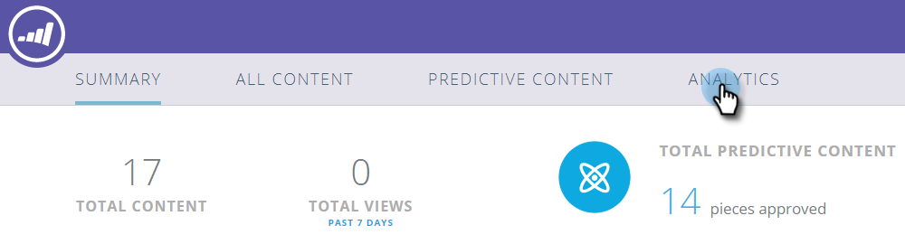

# Présentation de Predictive Content Analytics {#predictive-content-analytics-overview}

Utilisez l’analyse de contenu pour obtenir des informations supplémentaires sur votre contenu existant, découvrir (en fonction de l’IA et des algorithmes prédictifs) quel contenu convient à vos audiences et augmenter le retour sur investissement de vos efforts marketing.

>[!NOTE]
>
>L’onglet Analytics et les fonctionnalités d’analyse de contenu sont disponibles exclusivement avec le contenu prédictif Marketo.

## Vue d’ensemble {#overview}

Sur la page Résumé, cliquez sur **Analytics**.

Analytics comprend plusieurs sections : Contenu supérieur par vues, Contenu supérieur par taux de conversion, Contenu de tendance, Contenu suggéré et Contenu.

Pointez sur le point d’interrogation d’un en-tête de section pour plus de détails.

Cliquez sur le bouton Exporter pour exporter les résultats de cette section via Excel.

Vous pouvez filtrer les résultats selon différents attributs/propriétés (par exemple, liste de comptes ABM, pays, etc.).

Cliquez sur l’icône du calendrier pour modifier les dates des données reflétées. Choisissez une durée prédéfinie ou une période spécifique.

## Meilleur contenu par nombre de vues {#top-content-by-views}

Affiche les principaux éléments de contenu par nombre de vues au cours de la période sélectionnée.

## Meilleur contenu par taux de conversion {#top-content-by-conversion-rate}

Affiche le contenu à conversion supérieure par taux de conversion pour la période sélectionnée.

>[!NOTE]
>
>**Définition**
>
>**Taux de conversion** : pourcentage calculé par conversions directes divisé par le nombre de clics.

## Contenu tendance {#trending-content}

Affiche l’augmentation de popularité d’une partie de contenu en observant l’augmentation des vues des deux dernières semaines par rapport à la même période précédente.

## Contenu suggéré {#suggested-content}

Affiche le contenu que nous vous suggérons de promouvoir dans vos activités marketing en fonction du filtre que vous avez défini.

Passez la souris sur une image dans Contenu suggéré pour afficher les options disponibles.

>[!NOTE]
>
>Vous voyez ces icônes en bas ? Ils sont de gauche à droite : Afficher le contenu, Exporter au format CSV, Approuver le contenu.

## Contenu {#content}

Recherchez l’élément de contenu souhaité et cliquez dessus pour afficher des détails supplémentaires, notamment : les visiteurs qui le visualisent, les nouveaux visiteurs par rapport aux visiteurs réguliers, connus et anonymes, les principaux emplacements d’où proviennent les visiteurs lors de l’affichage du contenu et les principaux secteurs d’activité dont ils proviennent.

>[!NOTE]
>
>Le contenu similaire est basé sur le contenu sélectionné et est calculé par un algorithme d’association de règles. Les résultats représentent des éléments de contenu sur lesquels les visiteurs cliqueront le plus probablement, en fonction de l’élément sélectionné et du comportement des visiteurs précédents. Il ne prend pas en compte le filtre ou la plage de dates.
